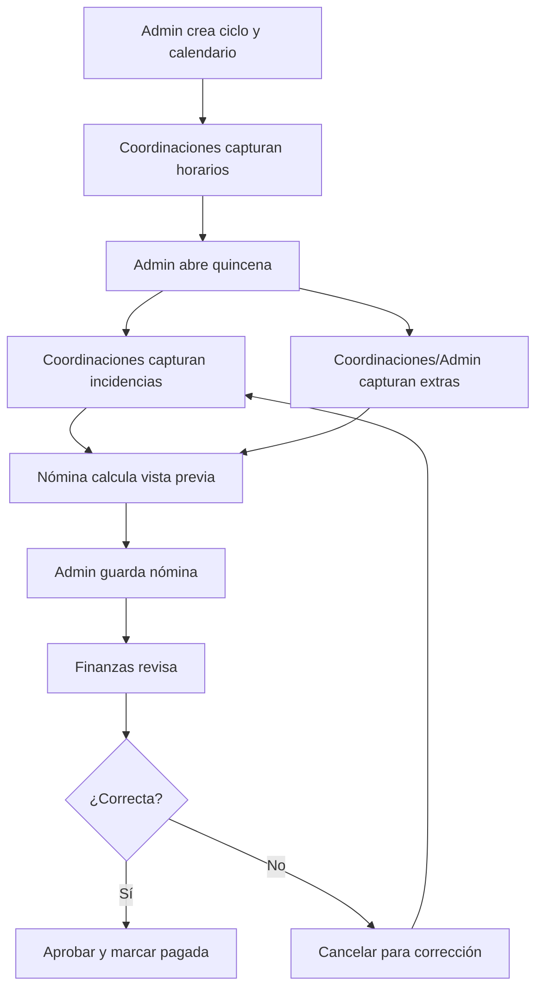
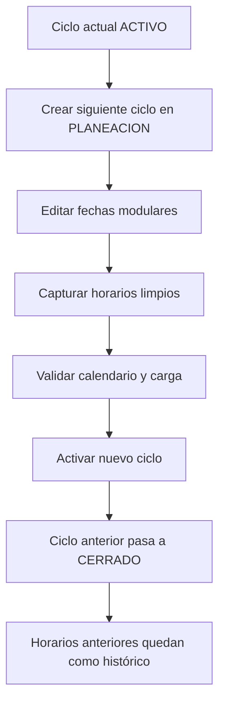

# Manual de entrega - Nómina Docente

**Proyecto:** Nómina Docente  
**Versión de entrega:** 1.2 post-H23

**Fecha original:** 8 de mayo de 2026

**Última actualización:** 1 de septiembre de 2026
**Ambiente:** Producción Google Cloud / Firebase  
**Dominio permitido:** `@tecplayacar.edu.mx`  
**Administrador general protegido:** `victor.yama@tecplayacar.edu.mx`

---

## 1. Resumen ejecutivo

Nómina Docente es una Web App administrativa para gestionar la operación académica y financiera de docentes: directorio, horarios, incidencias, extras, calendario operativo, cálculo de nómina, reportes financieros, expediente fiscal y auditoría.

El sistema moderno sustituyó la operación legacy en Google Apps Script, retirada del repositorio en H06/H14. La plataforma usa Firebase Auth con inicio de sesión por Google, frontend moderno en Vue 3, backend en Cloud Run y base de datos PostgreSQL en Cloud SQL.

La operación quedó organizada por ciclos escolares y quincenas. Esto permite preparar un ciclo futuro en planeación sin afectar el ciclo vigente, capturar horarios limpios por ciclo, cerrar ciclos anteriores como histórico y calcular nómina solamente sobre quincenas oficiales del Calendario Operativo.

---

## 2. Alcance del sistema

### 2.1 Incluido

- Inicio de sesión con Google.
- Restricción por dominio institucional.
- Control de accesos por usuario, rol y permisos.
- Administrador general protegido.
- Catálogos administrativos para asignaturas y tabuladores.
- Directorio docente con datos académicos, fiscales y bancarios.
- Expediente fiscal con carga/vista previa/descarga de constancia fiscal.
- Cálculo de fecha de nacimiento y cumpleaños desde RFC.
- Captura de horarios por ciclo escolar.
- Validación de carga máxima por categoría docente.
- Captura de incidencias por quincena.
- Captura de extras por quincena.
- Calendario operativo con quincenas, días inhábiles y fechas modulares.
- Apertura, edición, activación y cierre operativo de ciclos.
- Cálculo quincenal de nómina.
- Guardado definitivo de nómina.
- Restauración para corrección cuando una nómina se cancela.
- Finanzas y reportes sobre nóminas guardadas.
- Reportes Operativos H18 de horas base/extras y carga por categoría, con exportación CSV/XLSX.
- Preview H20 para Coordinador con docentes propios o compartidos por horario, en modo solo lectura y sin datos fiscales.
- Exportaciones CSV.
- PDF de reportes financieros.
- PDF de comprobantes de pago en efectivo.
- Auditoría y bitácora de acciones relevantes.
- Despliegue en Firebase Hosting y Cloud Run.

### 2.2 No incluido en esta versión

- Timbrado fiscal automático.
- Dispersión bancaria automática.
- Firma digital del docente.
- Notificaciones automáticas por correo.
- Integración directa con Moodle.
- Portal independiente para docentes.
- Cierre contable externo.

Estas funciones pueden agregarse posteriormente sin rehacer la arquitectura principal.

---

## 3. Arquitectura general

### 3.1 Stack tecnológico

| Capa | Tecnología | Uso |
|---|---|---|
| Frontend | Vue 3 + Vite + TypeScript | Interfaz administrativa modular |
| Rutas | Vue Router | URLs reales por módulo |
| Estado | Pinia | Sesión, permisos y estado compartido |
| Autenticación | Firebase Auth con Google | Login institucional |
| Backend | Fastify + TypeScript | API REST de negocio |
| Ejecución backend | Cloud Run | Servicio escalable y administrado |
| Base de datos | Cloud SQL PostgreSQL | Datos operativos, históricos y auditoría |
| Archivos | Cloud Storage | Constancias fiscales |
| Hosting | Firebase Hosting | Publicación de Web App y rewrite de API |
| Contenedores | Artifact Registry | Imagen Docker del API |
| Secretos | Secret Manager | Contraseña de base de datos |

Estado productivo verificado el 2026-09-01: revisión Cloud Run
`nomina-api-00055-8wn`, imagen `h23-prod-9268d42`, digest
`sha256:2e6dcf48aa54669c12a3efbf738737297434a528ba9e8040d9b7fa8638130e92`,
Firebase Hosting release `1787419305880000` y version
`07924eeeb7713f30`.

### 3.2 URLs de producción

| Servicio | URL |
|---|---|
| Web App | `https://nomina-docente-prod.web.app` |
| API Cloud Run | `https://nomina-api-443985127112.us-central1.run.app` |
| Health vía Hosting | `https://nomina-docente-prod.web.app/api/health` |

### 3.3 Proyecto Google Cloud

| Recurso | Valor |
|---|---|
| Project ID | `nomina-docente-prod` |
| Región principal | `us-central1` |
| Cloud SQL | `nomina-docente-web` |
| Base de datos | `nomina_docente` |
| Usuario app | `app_nomina` |
| Service account API | `nomina-api-sa@nomina-docente-prod.iam.gserviceaccount.com` |
| Bucket constancias | `gs://nomina-docente-prod-constancias` |
| Bucket imports/backups | `gs://nomina-docente-prod-sql-imports` |

---

## 4. Modelo de seguridad

### 4.1 Autenticación

1. El usuario inicia sesión con Google.
2. Firebase Auth valida la identidad.
3. El frontend obtiene token de Firebase.
4. El backend valida el token con Firebase Admin.
5. El backend rechaza correos fuera de `@tecplayacar.edu.mx`.
6. El backend busca el correo en `app_users`.
7. Solo usuarios con estatus `ACTIVO` pueden ingresar.
8. Los permisos se toman desde PostgreSQL.

### 4.2 Administrador protegido

El usuario `victor.yama@tecplayacar.edu.mx` es el administrador general protegido. No puede ser eliminado ni degradado por otros administradores. Esta protección existe tanto en lógica del backend como en trigger de base de datos.

### 4.3 Roles principales

| Rol | Alcance |
|---|---|
| Admin | Acceso completo, usuarios, calendario, nómina, finanzas, auditoría y configuración |
| Coordinador | Consulta global de Directorio; edición por `teachers.created_by`; operación por alcance/capturador; preview H20 de docentes propios o compartidos sin finalización ni datos fiscales |
| Dirección/Subdirección | Consulta global de Nómina y Reportes; sin finalización ni workflow financiero; edición de Extras solo propios cuando aplica |
| RH | Gestión global de expedientes fiscales y acceso autorizado a carga por categoría |
| Finanzas | Consulta financiera, expediente fiscal, reportes y pagos |
| Contador/Contabilidad | Exportación y consulta financiera autorizada; sin gestión fiscal ni workflow |

### 4.4 Permisos funcionales

| Permiso | Descripción |
|---|---|
| `dashboard.view` | Ver dashboard |
| `teachers.manage` | Gestionar docentes |
| `schedules.manage` | Gestionar horarios |
| `incidences.manage` | Gestionar incidencias |
| `extras.manage` | Gestionar extras |
| `payroll.view` | Ver nómina |
| `payroll.preview` | Consultar vista previa de nómina según alcance |
| `payroll.finalize` | Guardar nómina |
| `reports.view` | Ver reportes |
| `statistics.view` | Ver estadísticas |
| `finance.view` | Ver finanzas; no habilita fiscal, exportación ni workflow por sí solo |
| `finance.global_view` | Ver Finanzas de todas las coordinaciones en modo consulta |
| `fiscal.manage` | Gestionar datos fiscales; documentos usan permisos separados |
| `calendar.manage` | Gestionar calendario operativo |
| `closures.manage` | Gestionar cierres |
| `access.manage` | Gestionar accesos |
| `audit.view` | Ver auditoría |

---

## 5. Mapa funcional de vistas

| Vista | Ruta | Propósito |
|---|---|---|
| Login | `/login` | Inicio de sesión Google |
| Dashboard | `/` | Resumen general y estado de módulos |
| Directorio Docente | `/docentes` | Alta, edición, baja y exportación de docentes |
| Expediente Fiscal | `/expediente-fiscal` | Datos fiscales, constancia y cumpleaños |
| Catálogos Administrativos | `/catalogos` | Asignaturas y tabuladores de pago |
| Capturar Horarios | `/horarios` | Captura de carga docente por ciclo |
| Capturar Incidencias | `/incidencias` | Faltas, retardos y extras de horario por quincena |
| Capturar Extras | `/extras` | Horas extra externas por quincena |
| Nómina | `/nomina` | Vista previa, cálculo y guardado de nómina |
| Reportes Operativos | `/reports` | Horas base/extras y carga por categoría con CSV/XLSX |
| Reportes y Finanzas | `/finanzas` | Pagos, reportes, PDF, CSV y trazabilidad financiera |
| Calendario Operativo | `/calendario` | Ciclos, quincenas, módulos y días inhábiles |
| Control de Accesos | `/accesos` | Usuarios, roles y estatus |
| Auditoría y Bitácora | `/auditoria` | Trazabilidad operativa |

---

## 6. Funcionamiento por módulo

### 6.1 Login y sesión

El login usa Google como proveedor. La sesión real se valida contra el backend y la base de datos. Un usuario con correo institucional no puede entrar automáticamente: además debe estar registrado en Control de Accesos y tener estatus `ACTIVO`.

Reglas clave:

- Solo se permite `@tecplayacar.edu.mx`.
- El token de Firebase se valida en cada petición protegida.
- Los permisos no se confían al frontend; se consultan desde PostgreSQL.

### 6.2 Dashboard

Vista inicial del sistema. Resume el estado general de la plataforma y sirve como punto de orientación para los módulos principales. No realiza operaciones críticas de escritura.

### 6.3 Control de Accesos

Permite administrar usuarios autorizados. Desde este módulo se puede:

- Crear usuarios.
- Editar nombre, correo, rol, estatus y observaciones.
- Desactivar usuarios.
- Eliminar usuarios cuando las reglas lo permiten.

Restricciones:

- El administrador protegido no puede eliminarse ni degradarse.
- Un administrador no debe dejar el sistema sin administradores activos.
- Solo usuarios activos pueden iniciar sesión.

### 6.3.1 Catálogos Administrativos

Módulo exclusivo para administradores. Permite gestionar los catálogos usados por captura de horarios, extras y nómina:

- Alta y edición de asignaturas.
- Activación e inactivación de asignaturas.
- Alta y edición de tabuladores.
- Modificación del monto por hora.
- Activación e inactivación de tabuladores.
- Orden de visualización de tabuladores.
- Consulta de uso operativo e histórico.

Reglas clave:

- Inactivar un catálogo lo oculta de nuevas capturas, pero conserva los históricos.
- Los horarios y nóminas guardadas conservan el nombre y monto capturado como snapshot.
- Cambiar un tabulador no recalcula nóminas históricas.
- Las acciones quedan registradas en auditoría.

### 6.3.2 Importación CSV de docentes (H22)

**Estado productivo:** H22 cerrado operativo. La migración `014`, API/Hosting
y el smoke autenticado fueron aprobados. No se ejecutó Apply ni se aplicó un
CSV institucional durante el deploy original. Una ejecución autorizada
posterior creó 14 docentes; H22-HF1B corrigió solo su proyección de lectura y
no repitió Apply.

H22 agrega la pestaña Admin
`apps/web/src/components/catalogs/TeacherImportPanel.vue` y tres endpoints:

```text
GET  /api/teachers/import/template
POST /api/teachers/import/preview
POST /api/teachers/import/apply
```

Los tres usan guarda explícita Admin-only. La UI oculta la pestaña a
Coordinador, Dirección y RH, pero el backend mantiene `403` como autoridad.

Contrato técnico:

- template `blank`, `active` o `all`, con diez columnas operativas exactas;
- Preview parsea de nuevo, valida UUID/identificador/nombre, responsables,
  dependencias, acciones y riesgos, sin escribir ni auditar;
- Apply recibe archivo y fingerprints, pero no confía en acciones calculadas
  por el cliente;
- advisory lock serializa importaciones;
- `SELECT ... FOR UPDATE` y fingerprints detectan concurrencia;
- una sola transacción garantiza atomicidad;
- PostgreSQL conserva autoridad final y `23505` se traduce a conflicto seguro;
- auditoría registra resumen y cambios operativos, nunca CSV/Base64 ni fiscales.

La migración:

```text
014_h22_teacher_external_identifier_unique.sql
```

crea el índice único parcial
`teachers_external_identifier_unique_idx` sobre
`upper(btrim(external_identifier))`, excluyendo vacíos. No contiene DML ni
modifica filas.

El hotfix H22-HF1B corrigió exclusivamente la proyección de lectura de
Directorio: `Responsable operativo` muestra nombre/correo del usuario asociado
a `teachers.created_by`. No usa `coordinationName` como sustituto, no muestra
UUID técnicos y conserva `Sin responsable` para legacy con `created_by IS
NULL`. No requirió corrección de BD, Apply ni migración.

Nombres legacy:

- si no hay cambio nominal, se conservan `full_name` y `normalized_name`;
- un cambio operativo no reconstruye nombres con componentes vacíos;
- un cambio nominal explícito usa los componentes efectivos y vuelve a validar
  unicidad;
- una fila `SIN_CAMBIOS` no ejecuta UPDATE ni genera auditoría por docente.

Datos excluidos:

- RFC;
- banco, cuenta y CLABE;
- correo o expediente fiscal;
- tipo de pago;
- constancias;
- nómina, corridas y snapshots.

Pruebas predeploy posteriores a los fixes: API 27/27, web 79/79, integración
PostgreSQL 105/105, prueba focal del panel 11/11, typecheck y build OK.

### 6.4 Directorio Docente

Administra la base maestra de docentes. Incluye:

- Nombre.
- RFC.
- Correo.
- Teléfono.
- Categoría docente.
- Estatus `ACTIVO` / `INACTIVO`.
- Coordinación.
- Tipo de pago.
- Datos bancarios.
- Datos fiscales.
- Constancia fiscal.

Reglas clave:

- Solo docentes `ACTIVO` pueden participar en horarios y extras.
- Los docentes pueden exportarse en CSV.
- Existe exportación de docentes activos.
- Existe exportación completa con historial de cambios.
- El borrado de docentes respeta dependencias operativas.
- Coordinador puede consultar el detalle operativo de todos los docentes. Solo puede editar docentes cuyo `teachers.created_by` corresponde a su usuario; Admin conserva alcance global. Los datos fiscales requieren permisos separados.
- H19 normalizó productivamente `teachers.created_by` en 36 docentes existentes y registró 3 altas mínimas con backup, preview `ROLLBACK` y validación sin duplicados. Es evidencia de mantenimiento, no un procedimiento de carga automática.

### 6.5 Expediente Fiscal

Concentra información fiscal y bancaria para Finanzas/Contador/RH. Permite:

- Revisar RFC, correo, datos bancarios y constancia.
- Ver vista previa de constancia fiscal.
- Descargar constancia fiscal.
- Editar datos fiscales desde el módulo.
- Exportar listado de cumpleaños.

La fecha de nacimiento se calcula desde RFC cuando el formato lo permite.
Los coordinadores solo pueden actualizar expedientes de docentes de su coordinación; Admin, Finanzas y RH pueden gestionar expedientes de forma global.

### 6.6 Calendario Operativo

Es la fuente oficial para el cálculo de nómina. Administra:

- Ciclos escolares.
- Vigencia pagable inclusiva de horas base por ciclo.
- Fechas modulares por ciclo.
- Quincenas.
- Días inhábiles dentro de cada quincena.
- Apertura con fecha/hora para incidencias y extras.
- Días de acceso para incidencias y extras, contados como periodos de 24 horas desde la apertura.

Reglas clave:

- La vigencia base define el intervalo inclusivo en que Horarios regulares generan L-V/S1/S2 pagables.
- Módulo 1 y Módulo 2 deben quedar completamente contenidos dentro de la vigencia base.
- Las fechas modulares pertenecen al ciclo, no a cada quincena.
- Las quincenas pertenecen a un ciclo.
- Los días inhábiles afectan el cálculo de horas base.
- La apertura de incidencias y extras debe caer dentro del rango de la quincena.
- La vigencia base no abre ventanas ni limita Extras independientes; sus ventanas siguen bajo control manual de Admin.
- Una quincena con nómina guardada no debe eliminarse.

### 6.7 Apertura y cierre de ciclos

El sistema maneja tres estados de ciclo:

| Estado | Uso |
|---|---|
| `PLANEACION` | Preparar ciclo futuro, fechas, quincenas y horarios limpios |
| `ACTIVO` | Operación real de incidencias, extras, nómina y finanzas |
| `CERRADO` | Histórico, sin edición operativa |

Flujo recomendado:

1. Crear el ciclo futuro en `PLANEACION`.
2. Ajustar fechas modulares según operación real.
3. Capturar horarios limpios del nuevo ciclo.
4. Mantener el ciclo vigente como `ACTIVO` hasta concluir la operación.
5. Activar el nuevo ciclo cuando corresponda.
6. El ciclo anterior pasa a `CERRADO`.
7. Los horarios del ciclo cerrado no se eliminan de la base, pero salen de la vista operativa de Capturar Horarios.

### 6.8 Capturar Horarios

Permite capturar carga docente por ciclo. Cada horario queda ligado a:

- Ciclo.
- Docente.
- Coordinación.
- Asignatura.
- Grupo.
- Tabulador.
- Horas L, M, X, J, V.
- Horas S1 y S2.

Reglas clave:

- Solo ciclos `ACTIVO` o `PLANEACION` aparecen en captura operativa.
- Los ciclos `CERRADO` quedan como histórico.
- Los horarios se capturan limpios por ciclo.
- No se copian automáticamente horarios del ciclo anterior.
- Solo docentes `ACTIVO` pueden seleccionarse.
- Coordinadores capturan con su coordinación por defecto.
- Admin puede elegir cualquier coordinación.
- Solo la coordinación que capturó puede editar/eliminar, excepto Admin.

### 6.9 Límites de carga por categoría

| Categoría | Descripción | Máximo |
|---|---|---:|
| `V` | VIP | 35 horas |
| `M` | Medio tiempo | 25 horas |
| `N` | Nuevo ingreso | 15 horas |

El sistema valida:

- Carga semanal L-V.
- Carga con módulo 1.
- Carga con módulo 2.
- Indicadores visuales: disponible, cerca del límite, al límite, excede límite.
- No permite guardar horarios que excedan el máximo.

### 6.10 Tabuladores

Tabuladores actuales:

| Tabulador | Monto |
|---|---:|
| LIC-LIC | $125 |
| MAE-LIC | $135 |
| DOC-LIC | $135 |
| DOC-MAES | $220 |
| MAE-MAE | $180 |
| DOC-DOC | $190 |
| ESP-ESP | $220 |
| ESP-INGLES | $180 |

El tabulador se usa para cálculo de horas base, descuentos y extras.

### 6.11 Capturar Incidencias

Las incidencias se capturan por quincena. El usuario selecciona ciclo y quincena del calendario.

Campos principales:

- Faltas.
- Retardos.
- Extras de horario.

Reglas:

- Solo se capturan en ciclo `ACTIVO`.
- Solo se capturan sobre una quincena existente.
- Solo se capturan durante la ventana de acceso definida en Calendario.
- Solo la coordinación que capturó el horario puede editar sus incidencias, excepto Admin.
- Si la nómina de la quincena ya fue guardada, la incidencia queda bloqueada.
- Las faltas descuentan horas.
- Los retardos descuentan 0.5 horas por retardo.
- Los extras de incidencia suman horas al pago con el tabulador del horario.

### 6.12 Capturar Extras

Registra horas extra externas a horarios/incidencias. Cada extra tiene:

- Docente.
- Coordinación.
- Fecha.
- Horas.
- Motivo.
- Tabulador/monto.
- Referencia.
- Observaciones.

Reglas:

- Solo se capturan en ciclo `ACTIVO`.
- La fecha del extra debe caer dentro de una quincena abierta.
- Solo se capturan durante la ventana de acceso definida para extras en Calendario.
- Si la quincena ya tiene nómina guardada, no permite captura ni edición.
- Cualquier coordinador puede agregar extras a cualquier docente.
- Solo quien capturó el extra puede editarlo/eliminarlo, excepto Admin.
- Si extras + incidencias + carga horaria exceden el máximo de categoría, el sistema advierte pero permite guardar el extra como evidencia operativa.

### 6.13 Nómina

Calcula la nómina quincenal con base en:

- Ciclo activo.
- Quincena seleccionada.
- Vigencia pagable inclusiva de horas base del ciclo.
- Días hábiles L-V dentro del rango.
- Días inhábiles configurados.
- Fechas modulares del ciclo.
- Sábados recurrentes de módulo 1 y módulo 2 dentro del rango.
- Horarios activos del ciclo.
- Incidencias de la quincena.
- Extras de la quincena.
- Tabulador capturado por horario/extra.

Reglas de cálculo:

- La quincena se intersecta primero con la vigencia pagable del ciclo.
- L-V se multiplica por las veces que cada día aparece en esa interseccion.
- Módulo 1 y módulo 2 cuentan sábados recurrentes dentro del rango modular, la vigencia base y la quincena.
- Puede haber quincenas con traslape operativo entre L-V, M1 y M2.
- Faltas descuentan horas.
- Retardos descuentan 0.5 horas.
- Extras de incidencia suman al tabulador del horario.
- Extras externos suman al tabulador asignado al extra.
- Sin ocurrencias base elegibles, faltas, retardos y extras de incidencia aportan cero.
- Extras independientes conservan su elegibilidad por fecha, quincena y ventana administrativa.

Alcance por rol:

- Coordinador consulta, en modo solo lectura, docentes propios o con horario en sus coordinaciones y ve la carga completa del docente entre coordinaciones. No puede guardar/finalizar ni ver datos fiscales.
- Dirección/Subdirección consulta la nómina viva de todas las coordinaciones en modo solo lectura.
- Admin puede consultar, calcular y guardar la nómina.

### 6.14 Guardar nómina

Guardar nómina crea una corrida histórica:

- `payroll_runs`.
- `payroll_lines`.
- `payroll_schedule_details`.
- `payroll_extra_details`.

Al guardar:

- Se conserva el histórico de cálculo.
- Se limpian incidencias y extras operativos de esa quincena.
- La quincena queda cerrada para captura operativa.
- Los reportes financieros se alimentan de la nómina guardada, no de datos vivos.

### 6.15 Corrección de nómina

Si Finanzas detecta un error después de guardar nómina:

1. Se cancela la corrida para corrección.
2. El sistema restaura incidencias y extras desde el histórico de la nómina cancelada.
3. La quincena vuelve a quedar disponible para ajuste.
4. Se recalcula.
5. Se guarda una nueva nómina.

La corrida cancelada permanece en histórico y auditoría.

### 6.16 Reportes y Finanzas

Trabaja sobre nóminas guardadas. No recalcula desde capturas vivas.

Incluye:

- Resumen ejecutivo.
- Pagos.
- Coordinaciones.
- Pendientes fiscales.
- Histórico.
- Flujo financiero.
- PDF resumen.
- PDF por coordinación.
- PDF de comprobantes en efectivo.
- Exportaciones CSV.

Estados de nómina:

| Estado | Significado |
|---|---|
| `CALCULADA` | Nómina guardada desde el módulo Nómina |
| `EN_REVISION` | En revisión financiera |
| `APROBADA` | Lista para pago |
| `PAGADA` | Pago confirmado |
| `CANCELADA` | Cancelada para corrección |
| `CERRADA` | Estado histórico reservado |

### 6.17 Reportes Operativos

El módulo independiente `/reports` ofrece:

- `Horas base y extras`: disponible para Admin y Dirección/Subdirección.
- `Horas base por categoría`: disponible para Admin, Dirección/Subdirección, Coordinador y RH; Coordinador limitado a su alcance operativo.
- Filtros legibles por ciclo/quincena y búsqueda general, sin IDs técnicos visibles.
- Exportación CSV UTF-8 y XLSX real generado en API.
- Datos vivos o snapshots según exista una corrida guardada no cancelada.

No expone RFC, banco, cuenta, CLABE, `paymentType` ni constancias.

### 6.18 Comprobantes de pago en efectivo

El sistema genera comprobantes PDF para docentes con pago en efectivo. Cada comprobante contiene:

- Quincena.
- Nombre del docente.
- Coordinación.
- Monto pagado.
- Fecha de emisión.
- Texto de conformidad.
- Espacio para firma.

El formato está pensado para media carta: dos comprobantes por hoja tamaño carta.

### 6.19 Auditoría y Bitácora

Registra eventos relevantes:

- Alta, edición y eliminación de usuarios.
- Alta, edición y eliminación de docentes.
- Cambios en horarios.
- Cambios en incidencias.
- Cambios en extras.
- Guardado de nómina.
- Cambios de estado de nómina.
- Creación/edición/eliminación de quincenas.
- Creación, edición y activación de ciclos.

Permite filtrar por:

- Usuario.
- Acción.
- Módulo.
- Rango de fechas.
- Entidad.

---

## 7. Flujos operativos principales

### 7.1 Alta de usuario

1. Admin entra a Control de Accesos.
2. Crea usuario con correo institucional.
3. Asigna rol.
4. Define estatus `ACTIVO`.
5. El usuario inicia sesión con Google.
6. El backend valida dominio, correo registrado y permisos.

### 7.2 Alta de docente

1. Usuario autorizado entra a Directorio Docente.
2. Captura datos generales y fiscales.
3. Define categoría y estatus.
4. Docente queda disponible para horarios si está `ACTIVO`.
5. Se puede adjuntar constancia fiscal desde Directorio o Expediente Fiscal.

### 7.3 Preparar ciclo futuro

1. Admin entra a Calendario Operativo.
2. Crea ciclo en `PLANEACION`.
3. Ajusta fechas modulares.
4. Captura quincenas estimadas si aplica.
5. Coordinaciones capturan horarios limpios.
6. El ciclo vigente sigue operando sin afectación.

### 7.4 Activar nuevo ciclo

1. Admin valida que el ciclo en planeación esté listo.
2. En Calendario, activa el ciclo nuevo.
3. El ciclo anterior pasa a `CERRADO`.
4. Capturar Horarios muestra el nuevo ciclo como operativo.
5. Incidencias, Extras, Nómina y Finanzas trabajan sobre el ciclo activo.

### 7.5 Captura quincenal

1. Admin crea la quincena en Calendario.
2. Coordinadores capturan incidencias sobre esa quincena.
3. Coordinadores/Admin capturan extras con fecha dentro de la quincena.
4. Admin revisa vista previa de Nómina.
5. Admin guarda nómina.
6. Finanzas revisa y aprueba.
7. Finanzas marca pagada cuando corresponde.

### 7.6 Corrección de una quincena

1. Finanzas detecta inconsistencia.
2. Admin cancela la nómina para corrección.
3. El sistema restaura incidencias y extras.
4. Coordinación corrige datos.
5. Admin recalcula y guarda una nueva corrida.
6. Finanzas continúa flujo de revisión.

---

## 8. Modelo de datos resumido

| Tabla | Propósito |
|---|---|
| `roles` | Roles del sistema |
| `permissions` | Permisos funcionales |
| `role_permissions` | Relación rol-permiso |
| `app_users` | Usuarios autorizados |
| `coordinations` | Coordinaciones académicas |
| `teachers` | Directorio docente |
| `teacher_documents` | Constancias fiscales |
| `subjects` | Asignaturas |
| `tabulators` | Catálogo de tabuladores |
| `academic_cycles` | Ciclos escolares |
| `payroll_calendar_config` | Quincenas |
| `calendar_blackout_dates` | Días inhábiles |
| `schedules` | Horarios por ciclo |
| `schedule_incidences` | Incidencias por quincena |
| `extra_hours` | Extras por quincena |
| `payroll_runs` | Corridas de nómina |
| `payroll_lines` | Totales por docente/coordinación |
| `payroll_schedule_details` | Detalle histórico de horarios en nómina |
| `payroll_extra_details` | Detalle histórico de extras en nómina |
| `quarter_closures` | Cierres de cuatrimestre |
| `audit_log` | Auditoría |

---

## 9. Datos cargados al cierre preoperativo

Estado documental: snapshot histórico del 2026-05-08; no representa conteos productivos actuales. H17 y H19 modificaron posteriormente `teachers.created_by` y registraron altas controladas sin duplicados.

Después de la limpieza preoperativa, se conservaron datos maestros y se limpió la capa transaccional de pruebas.

| Concepto | Conteo |
|---|---:|
| Usuarios | 18 |
| Coordinaciones | 21 |
| Docentes | 202 |
| Horarios ciclo `2026-3` | 575 |
| Asignaturas | 262 |
| Tabuladores | 8 |
| Quincenas de prueba | 0 |
| Incidencias de prueba | 0 |
| Extras de prueba | 0 |
| Nóminas guardadas de prueba | 0 |
| Bitácora de prueba | 0 |

Respaldo preoperativo generado:

```text
gs://nomina-docente-prod-sql-imports/backups/preoperativo-limpieza-20260508-110808.sql.gz
```

---

## 10. Reglas de negocio críticas

1. Solo usuarios registrados y activos pueden acceder.
2. El dominio permitido es `@tecplayacar.edu.mx`.
3. El administrador protegido no puede ser eliminado ni degradado.
4. Solo docentes `ACTIVO` participan en horarios y extras.
5. Los horarios pertenecen a un ciclo.
6. Un ciclo cerrado no se edita operativamente.
7. El ciclo en planeación permite preparar horarios limpios.
8. Incidencias, extras y nómina solo operan sobre ciclo activo.
9. Incidencias se capturan por quincena.
10. Extras se capturan con fecha dentro de una quincena abierta.
11. Guardar nómina cierra la captura operativa de esa quincena.
12. Reportes financieros leen nóminas guardadas, no capturas vivas.
13. Cancelar nómina restaura datos para corrección y deja histórico.
14. La carga máxima depende de categoría docente.
15. Admin puede ver/editar globalmente; coordinadores operan según autoría y alcance, y H20 amplía únicamente su preview de nómina en modo lectura.
16. H05 controla migraciones; no se reaplica SQL histórico ni se ejecuta producción sin backup y aprobación.

---

## 11. Operación diaria recomendada

### 11.1 Antes de iniciar una quincena

- Verificar ciclo activo.
- Verificar que la quincena exista en Calendario.
- Capturar días inhábiles si aplican.
- Confirmar fechas modulares.
- Confirmar que docentes activos estén actualizados.

### 11.2 Durante la quincena

- Coordinadores capturan incidencias.
- Coordinadores/Admin capturan extras.
- Finanzas revisa pendientes fiscales.
- Sistemas/Admin atiende dudas de acceso.

### 11.3 Cierre de quincena

- Admin revisa vista previa de Nómina.
- Admin guarda nómina.
- Finanzas revisa reportes.
- Finanzas exporta CSV/PDF.
- Finanzas marca estados de revisión, aprobación y pago.

### 11.4 Si hay errores

- No editar directamente la base.
- Cancelar nómina para corrección desde Finanzas.
- Corregir incidencias/extras.
- Recalcular.
- Guardar nueva nómina.

---

## 12. Despliegue y mantenimiento

### 12.1 Build local

```powershell
npm install
npm run build
```

### 12.2 Desplegar frontend

```powershell
npx firebase deploy --only hosting --project nomina-docente-prod
```

### 12.3 Desplegar backend

```powershell
$gcloud = (Get-Command gcloud.cmd).Source
$image = 'us-central1-docker.pkg.dev/nomina-docente-prod/nomina/nomina-api:latest'

& $gcloud builds submit . `
  --config cloudbuild.api.yaml `
  --substitutions _IMAGE=$image `
  --project=nomina-docente-prod

& $gcloud run deploy nomina-api `
  --image $image `
  --project nomina-docente-prod `
  --region us-central1 `
  --platform managed `
  --service-account nomina-api-sa@nomina-docente-prod.iam.gserviceaccount.com `
  --set-cloudsql-instances nomina-docente-prod:us-central1:nomina-docente-web `
  --min-instances 0 `
  --max-instances 3 `
  --cpu 1 `
  --memory 512Mi `
  --concurrency 80 `
  --timeout 300s `
  --quiet
```

Antes de ejecutar, revisar variables, secretos y CORS con H13. El ejemplo no sustituye el procedimiento de release ni autoriza cambios productivos.

### 12.4 Validación rápida

```powershell
Invoke-RestMethod https://nomina-docente-prod.web.app/api/health
```

Respuesta esperada:

```json
{
  "ok": true,
  "service": "nomina-docente-api"
}
```

### 12.5 Resultado del despliegue H22

H22-F5 se ejecutó como ventana controlada:

1. Backup `1785456525085`, estado `SUCCESSFUL`.
2. `014` aplicada exclusivamente mediante H05.
3. H05 final: 17 registradas, 15 baseline, `013`/`014` aplicadas,
   `pending=0` y `checksum mismatch=0`.
4. API desplegada en `nomina-api-00053-cjg`, 100% del tráfico.
5. Hosting live release `1785457082597000`, version
   `466c8eb59d99c2dd`.
6. Healthchecks HTTP 200 y rutas protegidas sin sesión HTTP 401 esperado.
7. Smoke Admin/no Admin y responsive aprobado por el usuario.
8. Plantillas y Preview validados; no se ejecutó Apply institucional.

H22-HF1B se desplegó posteriormente en `nomina-api-00054-2ld`, Hosting release
`1785536172540000`. El smoke autenticado confirmó los 14 responsables reales,
sin ampliar permisos de edición ni exponer datos fiscales.

Rollback:

- API: regresar tráfico a la revisión anterior.
- Hosting: restaurar el release anterior.
- Si solo falla UI/API, conservar el índice `014`.
- No eliminar el índice improvisadamente.
- Restaurar backup solo mediante procedimiento DBA aprobado.

### 12.6 Resultado del despliegue H23

H23-F4 se ejecuto como ventana controlada:

1. Backup `1787418742938`, estado `SUCCESSFUL`.
2. Migracion `015_h23_cycle_base_hours_dates.sql` aplicada exclusivamente mediante H05.
3. H05 final: 18 registradas, 15 baseline, `013`/`014`/`015` aplicadas, `pending=0` y `checksum mismatch=0`.
4. Ciclo `27-1` configurado con vigencia pagable `2026-08-31` a `2026-12-12`; M1/M2 permanecieron sin cambios y contenidos.
5. API desplegada en `nomina-api-00055-8wn`, 100% del trafico.
6. Hosting live release `1787419305880000`, version `07924eeeb7713f30`.
7. Healthchecks HTTP 200, rutas protegidas sin sesion HTTP 401 y cero logs severos atribuibles a H23.
8. Smoke de Calendario, Preview, Incidencias, Reporte vivo, H20 y responsive aprobado.
9. La quincena `2026-08-10` a `2026-08-22` produce L-V, M1, M2, base e incidencias en cero.
10. No se guardo ni cancelo Nomina, no se abrio la ventana de Extras y no se capturaron propedeuticos.

Rollback H23:

- API: regresar trafico a `nomina-api-00054-2ld`.
- Hosting: restaurar release `1785536172540000`, version `91ba12f3159468b8`.
- Las columnas y fechas H23 pueden permanecer porque el codigo anterior las ignora.
- No eliminar constraints ni ejecutar SQL inverso improvisado.

---

## 13. Respaldos

### 13.1 Exportar respaldo manual

```powershell
$gcloud = (Get-Command gcloud.cmd).Source
$stamp = Get-Date -Format 'yyyyMMdd-HHmmss'
$uri = "gs://nomina-docente-prod-sql-imports/backups/backup-$stamp.sql.gz"

& $gcloud sql export sql nomina-docente-web $uri `
  --database=nomina_docente `
  --project=nomina-docente-prod `
  --quiet
```

### 13.2 Recomendación

- Mantener backups automáticos de Cloud SQL.
- Hacer respaldo manual antes de cierres importantes, importaciones masivas o limpiezas.
- No almacenar contraseñas en archivos del repo.
- Usar Secret Manager para credenciales.
- Para migraciones, ejecutar primero `db:migrate:inspect`, revisar H05 y crear backup; nunca usar `apply` sin aprobación explícita.
- Rollback API: devolver tráfico a la revisión anterior documentada. Rollback Hosting: restaurar el release anterior. H20 no tiene migración de BD que revertir.
- Para H22, cualquier Apply institucional futuro requiere CSV aprobado,
  Preview sin bloqueantes, backup y autorización humana independiente. La
  migración `014` ya fue aplicada por H05 y debe conservarse si un incidente es
  solo de API/UI.

---

## 14. Repositorio y control de versiones

Repositorio:

```text
https://github.com/victoryama-wq/nomina-docente-modern
```

Rama productiva:

```text
main
```

Recomendación de trabajo:

1. Crear rama por cambio.
2. Probar build local.
3. Revisar cambios.
4. Hacer commit descriptivo.
5. Subir a GitHub.
6. Desplegar backend/frontend según corresponda.

---

## 15. Validación de entrega

Antes de declarar una quincena como operación formal, validar:

- Login con usuario Admin.
- Login con usuario Coordinador.
- Acceso restringido por rol.
- Directorio docente.
- Carga/descarga de constancia fiscal.
- Creación de ciclo en planeación.
- Captura de horarios en ciclo de planeación.
- Creación de quincena.
- Captura de incidencias.
- Captura de extras.
- Cálculo de nómina.
- Guardado de nómina.
- Reportes de Finanzas.
- Exportación CSV.
- Generación PDF.
- Comprobantes en efectivo.
- Auditoría.
- Corrección por cancelación de nómina.

---

## 16. Recomendaciones post-entrega

1. Operar la primera quincena con acompañamiento de Sistemas.
2. Validar importes contra una muestra manual.
3. Definir responsable de Calendario Operativo.
4. Definir responsable de alta/baja de usuarios.
5. Capacitar a coordinaciones en captura de incidencias y extras.
6. Capacitar a Finanzas en reportes, pendientes fiscales y comprobantes.
7. Definir calendario de respaldos manuales antes de cada cierre.
8. Documentar cualquier excepción operativa real que aparezca en producción.

---

## 17. Anexo: flujo general



---

## 18. Anexo: apertura de ciclo futuro



---

## 19. Conclusión

El proyecto queda listo para uso formal con una arquitectura moderna, separación clara entre operación e histórico, control de acceso por rol, datos persistentes en PostgreSQL y reportes financieros sobre nóminas guardadas.

La recomendación final es operar la primera quincena con seguimiento cercano de Sistemas y Finanzas para validar importes reales, resolver dudas de captura y consolidar el procedimiento institucional.
