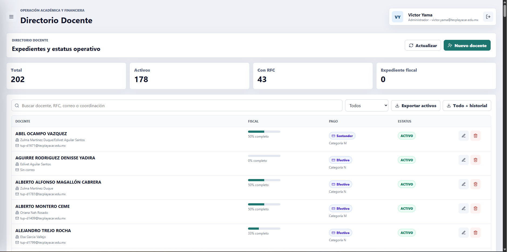
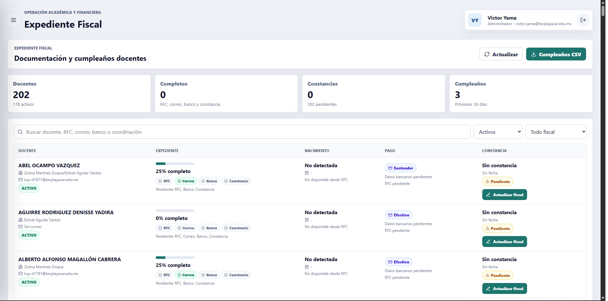
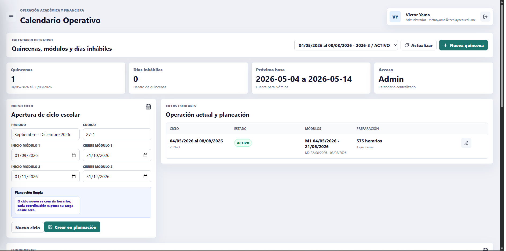
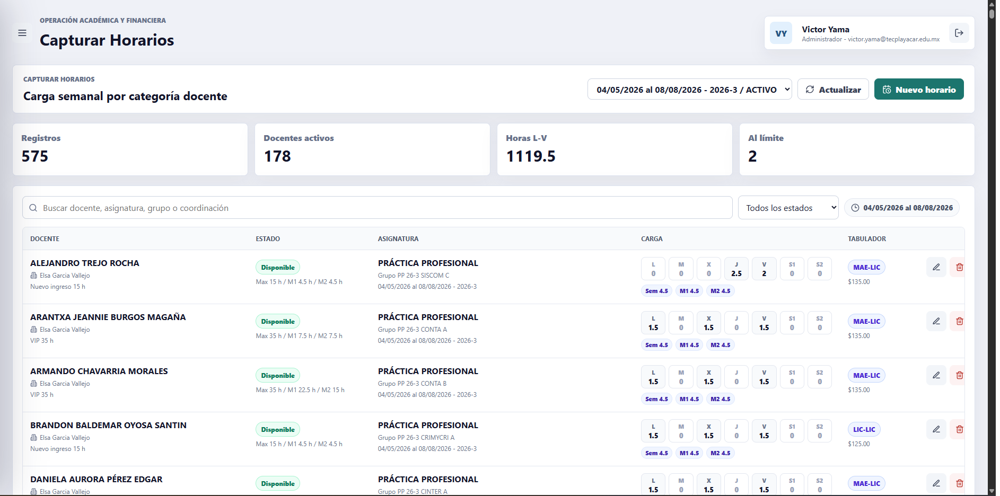
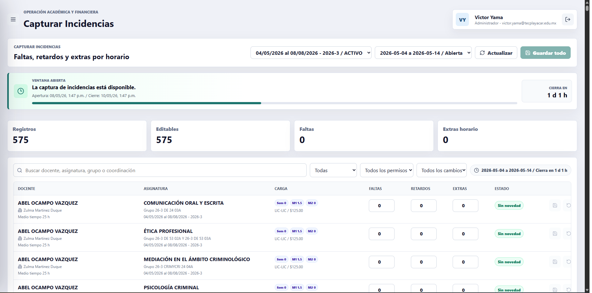
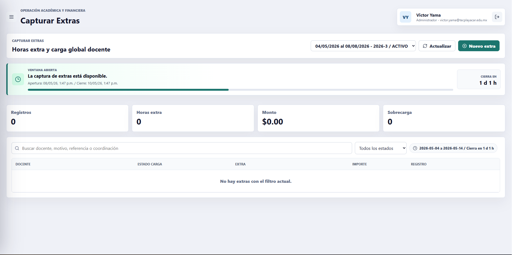
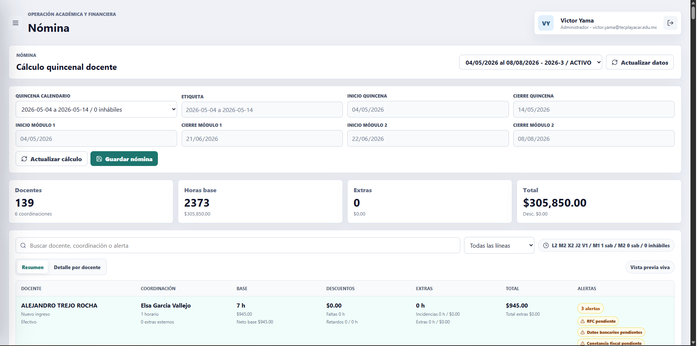
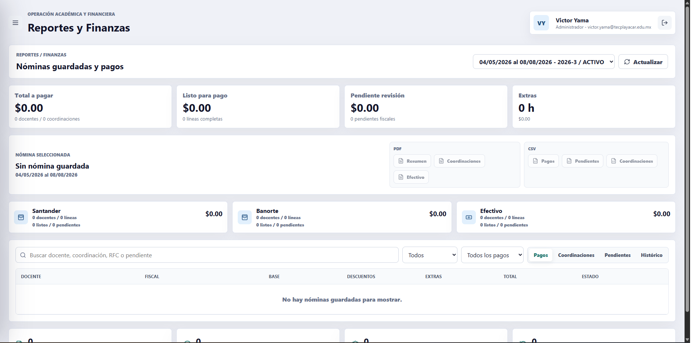
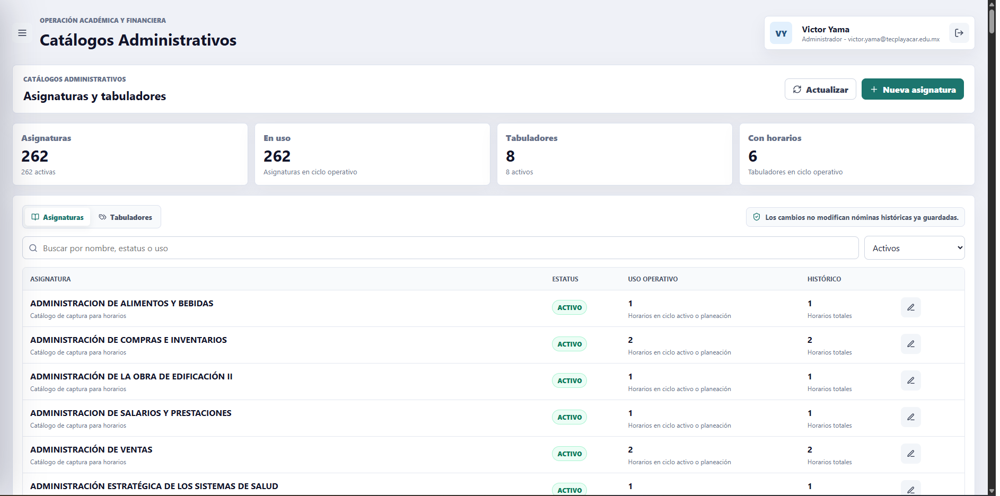
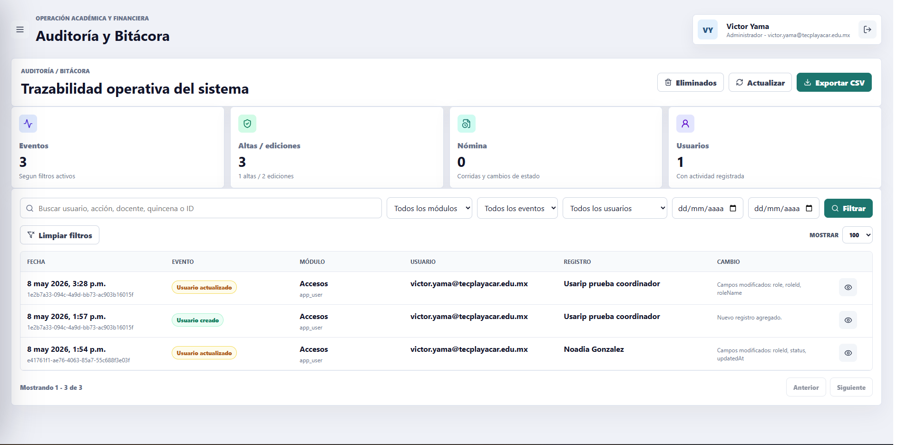

# Manual de uso - Nómina Docente

**Sistema:** Nómina Docente  
**Ambiente:** Producción  
**URL:** `https://nomina-docente-prod.web.app`  
**Dominio permitido:** `@tecplayacar.edu.mx`  
**Versión:** 1.0 operativa  
**Fecha de actualización:** 9 de mayo de 2026

---

## 1. Propósito del sistema

Nómina Docente es una plataforma web para administrar la operación académica y financiera relacionada con docentes. El sistema centraliza:

- Directorio docente.
- Expediente fiscal.
- Control de usuarios y roles.
- Catálogos administrativos.
- Calendario operativo.
- Captura de horarios.
- Captura de incidencias.
- Captura de horas extra.
- Vista previa y guardado de nómina.
- Reportes financieros.
- Auditoría y bitácora.

El objetivo principal es que las coordinaciones capturen la información operativa, que Administración revise y cierre los periodos oficiales, y que Finanzas consulte la nómina guardada con trazabilidad histórica.

## 2. Acceso al sistema

### 2.1 Requisitos de acceso

Para ingresar al sistema se requiere:

- Cuenta Google institucional con dominio `@tecplayacar.edu.mx`.
- Acceso previamente otorgado desde el módulo `Control de Accesos`.
- Usuario activo.
- Rol asignado.

Aunque una cuenta pertenezca al dominio institucional, no podrá entrar si no fue registrada y activada por un administrador.

### 2.2 Inicio de sesión

1. Abrir `https://nomina-docente-prod.web.app`.
2. Dar clic en `Ingresar con Google`.
3. Seleccionar la cuenta institucional.
4. Si el usuario está autorizado, el sistema abrirá el Dashboard.
5. Si el usuario no está autorizado, el sistema mostrará un mensaje de acceso restringido.

### 2.3 Cierre de sesión

El cierre de sesión se realiza desde el botón ubicado en la esquina superior derecha, junto al nombre del usuario.

## 3. Roles y alcance

Los permisos se aplican en dos niveles:

- Menú y vistas disponibles en la Web App.
- Validación real en el API antes de consultar, guardar, editar o eliminar información.

| Rol | Alcance general |
|---|---|
| Admin | Acceso completo al sistema, usuarios, calendario, catálogos, nómina, finanzas y auditoría |
| Coordinador | Captura y consulta operativa de docentes, horarios, incidencias, extras y nómina de su coordinación |
| Dirección/Subdirección | Acceso operativo tipo coordinación y consulta global de nómina viva y finanzas en modo lectura |
| RH | Acceso operativo tipo coordinación y gestión de expedientes fiscales |
| Finanzas / Contador | Consulta de nóminas guardadas, reportes financieros, pagos y pendientes fiscales |

### 3.1 Matriz resumida de módulos

| Módulo | Admin | Coordinador | Dirección/Subdirección | RH | Finanzas/Contador |
|---|---:|---:|---:|---:|---:|
| Dashboard | Sí | Sí | Sí | Sí | Sí |
| Directorio Docente | Sí | Sí | Sí | Sí | Consulta |
| Expediente Fiscal | Sí | Según permiso | Según permiso | Sí | Sí |
| Control de Accesos | Sí | No | No | No | No |
| Catálogos | Sí | No | No | No | No |
| Calendario | Sí | No | No | No | No |
| Capturar Horarios | Sí | Sí | Sí | Sí | No |
| Capturar Incidencias | Sí | Sí | Sí | Sí | No |
| Capturar Extras | Sí | Sí | Sí | Sí | No |
| Nómina | Sí | Consulta de su alcance | Consulta global | Consulta según permiso | Consulta |
| Finanzas | Sí | Consulta de su alcance | Consulta global | Consulta según permiso | Sí |
| Auditoría | Sí | No | No | No | No |

## 4. Navegación general

El sistema utiliza un menú lateral. En pantallas pequeñas o cuando el menú está abierto:

- Se puede cerrar con el botón `X`.
- Se puede cerrar dando clic fuera del menú.
- El contenido principal ocupa la pantalla disponible.

El menú solo muestra los módulos permitidos para el usuario. Si alguien intenta entrar manualmente a una URL sin permiso, el sistema lo redirige al Dashboard.

## 5. Dashboard

El Dashboard es la pantalla inicial después del inicio de sesión.

### 5.1 Qué muestra

- Métricas generales del sistema.
- Resumen de docentes.
- Resumen de horarios.
- Actividad operativa.
- Ruta inmediata sugerida.

### 5.2 Uso recomendado

Usar el Dashboard como punto de partida para verificar que el sistema está activo y que la sesión corresponde al usuario correcto.

## 6. Directorio Docente

El Directorio Docente concentra la información base de los docentes.

### 6.1 Información del docente

Cada docente puede contener:

- Nombre completo.
- Categoría docente.
- Coordinación responsable.
- Teléfono.
- Correo.
- RFC.
- Tipo de pago.
- Datos bancarios.
- Estatus `ACTIVO` o `INACTIVO`.
- Constancia fiscal.

### 6.2 Categorías docentes

Las categorías definen el límite máximo de carga:

| Categoría | Clave | Límite |
|---|---:|---:|
| VIP | V | 35 horas |
| Medio tiempo | M | 25 horas |
| Nuevo ingreso | N | 15 horas |

### 6.3 Alta de docente

1. Entrar a `Directorio`.
2. Dar clic en `Nuevo docente`.
3. Capturar la información requerida.
4. Guardar.

El formulario se abre en una ventana modal para no perder la vista de la tabla.

### 6.4 Edición de docente

1. Buscar al docente.
2. Dar clic en el botón de edición.
3. Actualizar la información.
4. Guardar.

Las coordinaciones solo deben editar docentes de su responsabilidad. Admin puede editar cualquier docente.

### 6.5 Eliminación de docente

La eliminación está reservada para Admin. Si el docente ya tiene historial operativo, horarios, extras o nómina, no debe eliminarse; se recomienda cambiar el estatus a `INACTIVO` para conservar la trazabilidad.

### 6.6 Exportaciones

El módulo permite exportar:

- Docentes activos.
- Todos los docentes con historial de cambios, según permisos de auditoría.

## 7. Expediente Fiscal

El módulo `Expediente Fiscal` permite revisar y actualizar información necesaria para pago y seguimiento administrativo.

### 7.1 Información revisada

- RFC.
- Correo.
- Banco, cuenta o CLABE capturada en datos bancarios.
- Tipo de pago.
- Constancia fiscal.
- Cumpleaños calculado desde RFC cuando el RFC es válido.

### 7.2 Vista previa de constancia

Si el docente tiene constancia fiscal cargada:

1. Dar clic en vista previa.
2. El sistema mostrará el documento en una ventana.
3. Si se cuenta con permiso, también se podrá descargar.

### 7.3 Actualización fiscal

1. Ubicar al docente.
2. Dar clic en editar expediente.
3. Capturar o corregir RFC, correo, banco y tipo de pago.
4. Cargar nueva constancia fiscal si corresponde.
5. Guardar.

RH, Admin y usuarios con permiso fiscal pueden actualizar expedientes conforme a su alcance.

### 7.4 Cumpleaños

El sistema calcula la fecha de nacimiento desde el RFC cuando la estructura lo permite. El listado puede exportarse para seguimiento de cumpleaños.

## 8. Control de Accesos

Módulo exclusivo para Admin.

### 8.1 Propósito

Permite administrar usuarios autorizados para entrar al sistema.

### 8.2 Alta de usuario

1. Entrar a `Accesos`.
2. Dar clic en `Nuevo acceso`.
3. Capturar nombre, correo institucional, rol y estatus.
4. Guardar.

El correo debe pertenecer al dominio institucional autorizado.

### 8.3 Edición de usuario

Admin puede editar usuarios existentes para:

- Cambiar nombre.
- Cambiar rol.
- Activar o desactivar acceso.

### 8.4 Administrador protegido

El usuario `victor.yama@tecplayacar.edu.mx` está protegido como administrador general. Otros administradores no deben poder eliminarlo.

## 9. Catálogos Administrativos

Módulo exclusivo para Admin.

### 9.1 Asignaturas

Permite registrar, editar y activar o desactivar asignaturas utilizadas en horarios.

### 9.2 Tabuladores

Permite administrar tabuladores de pago:

| Tabulador | Monto base |
|---|---:|
| LIC-LIC | $125 |
| MAE-LIC | $135 |
| DOC-LIC | $135 |
| DOC-MAES | $220 |
| MAE-MAE | $180 |
| DOC-DOC | $190 |
| ESP-ESP | $220 |
| ESP-INGLES | $180 |

Los cambios aplican a nuevas capturas. Las nóminas históricas conservan el monto calculado en el momento en que fueron guardadas.

## 10. Calendario Operativo

Módulo exclusivo para Admin. Es una de las fuentes más importantes del sistema.

### 10.1 Qué administra

- Ciclos escolares.
- Ciclo activo.
- Fechas modulares del cuatrimestre.
- Quincenas oficiales.
- Días inhábiles por quincena.
- Ventanas de acceso para capturar incidencias.
- Ventanas de acceso para capturar extras.

### 10.2 Ciclos escolares

El sistema maneja tres cuatrimestres por año:

| Periodo | Nomenclatura |
|---|---|
| Septiembre - Diciembre | Ciclo siguiente, terminación `-1` |
| Enero - Abril | Ciclo siguiente, terminación `-2` |
| Mayo - Agosto | Ciclo actual, terminación `-3` |

Ejemplo operativo: Mayo - Agosto 2026 corresponde a `2026-3`.

### 10.3 Fechas modulares

Las fechas de Módulo 1 y Módulo 2 se configuran por cuatrimestre, no por quincena.

Cada módulo tiene:

- Inicio Módulo 1.
- Cierre Módulo 1.
- Inicio Módulo 2.
- Cierre Módulo 2.

Estas fechas aplican a todas las quincenas del ciclo seleccionado.

### 10.4 Quincena

Para crear una quincena:

1. Seleccionar el ciclo.
2. Capturar etiqueta.
3. Capturar inicio de quincena.
4. Capturar cierre de quincena.
5. Capturar apertura de incidencias.
6. Capturar días de acceso para incidencias.
7. Capturar apertura de extras.
8. Capturar días de acceso para extras.
9. Agregar días inhábiles si existen.
10. Guardar.

### 10.5 Ventanas de captura

Las ventanas se calculan desde la fecha y hora de apertura.

Ejemplo:

- Quincena: `04/05/2026 al 14/05/2026`.
- Apertura: `08/05/2026 14:00`.
- Días de acceso: `2`.
- Cierre de captura: `10/05/2026 14:00`.

Durante ese periodo, Incidencias y Extras muestran cuenta regresiva y permiten capturar. Fuera de ese periodo quedan en modo consulta.

### 10.6 Días inhábiles

Los días inhábiles se descuentan del cálculo de nómina cuando caen dentro de la quincena.

Para agregar uno:

1. Elegir la fecha inhábil.
2. Capturar motivo.
3. Dar clic en `Agregar`.
4. Guardar la quincena.

### 10.7 Eliminación de quincena

Una quincena con nómina guardada no debe eliminarse. Si se elimina una quincena operativa, dejará de estar disponible como fuente para nómina.

## 11. Capturar Horarios

El módulo `Horarios` registra la carga base de los docentes por ciclo.

### 11.1 Reglas principales

- Solo deben participar docentes `ACTIVOS`.
- Un docente puede tener horarios en varias coordinaciones.
- Los horarios pertenecen a un ciclo escolar.
- Solo la coordinación responsable de la captura puede editar o eliminar su información, salvo Admin.

### 11.2 Alta de horario

1. Entrar a `Horarios`.
2. Seleccionar el ciclo.
3. Dar clic en `Nuevo horario`.
4. Buscar docente.
5. Seleccionar o confirmar coordinación.
6. Capturar asignatura, grupo, tabulador y monto.
7. Capturar horas por día y módulos.
8. Guardar.

Para usuarios coordinadores, la coordinación se toma por defecto del usuario logueado. Admin puede elegir cualquier coordinación.

### 11.3 Validación de carga

El sistema evalúa la carga contra el límite de la categoría:

- `Disponible`: debajo del 80% del límite.
- `Cerca del límite`: desde 80% y antes del tope.
- `Al límite`: exactamente en el límite.
- `Excede límite`: rebasa el máximo permitido.

Si la captura excede el límite, el sistema no permite guardar el horario.

### 11.4 Filtros y tabla

La tabla permite buscar y filtrar por:

- Docente.
- Estado de carga.
- Solo editables por el usuario.
- Asignatura.
- Coordinación.

La columna de carga muestra horas por día y por módulo para facilitar lectura.

## 12. Capturar Incidencias

El módulo `Incidencias` captura ajustes relacionados con horarios ya registrados.

### 12.1 Qué se captura

- Faltas.
- Retardos.
- Extras dentro del horario.

### 12.2 Reglas de cálculo

- Las faltas se descuentan como horas.
- Los retardos descuentan media hora por unidad.
- Los extras dentro de incidencias se suman como horas adicionales.
- El monto se calcula usando el tabulador del horario capturado.

### 12.3 Ventana de captura

El módulo muestra:

- Estado de la ventana.
- Apertura.
- Cierre.
- Cuenta regresiva.
- Barra de avance.

Solo se puede editar cuando la ventana configurada en Calendario está abierta.

### 12.4 Guardado

Puede guardarse:

- Por registro individual.
- Con `Guardar visibles`.
- Con `Guardar todo`.

La quincena queda bloqueada si la nómina ya fue guardada.

## 13. Capturar Extras

El módulo `Extras` registra horas extra independientes del horario base.

### 13.1 Reglas principales

- Cualquier coordinación puede agregar extras a cualquier docente.
- Solo quien capturó el extra puede editarlo o eliminarlo.
- Admin puede editar o eliminar cualquier extra.
- Si la nómina ya fue guardada, el extra queda bloqueado.
- Solo se puede capturar dentro de la ventana configurada en Calendario.

### 13.2 Sobrecarga

Al registrar extras, el sistema compara:

- Carga de horarios.
- Extras dentro de incidencias.
- Extras independientes.
- Límite por categoría.

Si se rebasa el límite, el sistema muestra advertencia, pero permite guardar para conservar evidencia operativa.

### 13.3 Alta de extra

1. Entrar a `Extras`.
2. Seleccionar ciclo activo.
3. Verificar que la ventana esté abierta.
4. Dar clic en `Nuevo extra`.
5. Buscar docente.
6. Capturar fecha, horas, motivo, tabulador y observaciones.
7. Guardar.

## 14. Nómina

El módulo `Nómina` calcula la vista previa quincenal antes de guardarla.

### 14.1 Fuente de cálculo

El cálculo utiliza:

- Horarios del ciclo activo.
- Quincena seleccionada en Calendario.
- Fechas modulares del ciclo.
- Días inhábiles.
- Incidencias de la quincena.
- Extras de la quincena.
- Tabulador del horario o extra correspondiente.

### 14.2 Cálculo de días

Para la quincena seleccionada:

- Se cuentan los días lunes a viernes que caen dentro del rango.
- Se restan días inhábiles configurados.
- Se suman sábados modulares cuando Módulo 1 o Módulo 2 caen dentro de la quincena.
- Pueden traslaparse Módulo 1 y Módulo 2 si ambos aplican dentro del rango.

### 14.3 Vista previa viva

La nómina puede consultarse antes de guardarse para revisión operativa. Esto permite detectar errores en incidencias o extras antes del cierre definitivo.

### 14.4 Guardar nómina

El botón `Guardar nómina` es exclusivo para Admin.

Al guardar:

- Se crea una corrida histórica.
- Se guardan líneas por docente.
- Se guardan detalles de horarios, incidencias y extras.
- Se bloquea la quincena para edición operativa.
- Incidencias y Extras quedan cerrados para esa quincena.

## 15. Reportes y Finanzas

El módulo `Finanzas` trabaja con nóminas ya guardadas. No recalcula desde datos vivos.

### 15.1 Vistas principales

- Pagos.
- Coordinaciones.
- Pendientes.
- Histórico.

### 15.2 Resumen financiero

Muestra:

- Total a pagar.
- Total listo para pago.
- Pendientes de revisión.
- Extras.
- Resumen por forma de pago.
- Nómina seleccionada.

### 15.3 Exportaciones

Según permisos, permite generar:

- PDF de resumen.
- PDF por coordinaciones.
- PDF de comprobantes de efectivo.
- CSV de pagos.
- CSV de pendientes.
- CSV por coordinación.

Dirección/Subdirección puede consultar globalmente y descargar el PDF por coordinaciones conforme al alcance definido.

### 15.4 Comprobante de pago en efectivo

El sistema genera comprobantes para docentes con pago en efectivo.

Características:

- Formato media carta.
- Dos comprobantes por hoja tamaño carta.
- Nombre del docente.
- Quincena.
- Monto.
- Espacio para firma de conformidad.

### 15.5 Flujo financiero

Estados disponibles:

| Estado | Significado |
|---|---|
| CALCULADA | Nómina guardada desde el módulo Nómina |
| EN_REVISION | Nómina enviada a revisión financiera |
| APROBADA | Nómina aprobada para pago |
| PAGADA | Pago ejecutado |
| CANCELADA | Nómina cancelada para corrección |

### 15.6 Corrección de nómina

Si se detecta un error después de guardar:

1. Admin cancela la nómina para corrección desde Finanzas.
2. El sistema restaura incidencias y extras desde el histórico de la nómina cancelada.
3. Se corrigen los datos necesarios.
4. Se recalcula la nómina.
5. Se guarda una nueva corrida.

## 16. Auditoría y Bitácora

Módulo exclusivo para Admin.

### 16.1 Qué registra

- Altas de docentes.
- Ediciones de docentes.
- Eliminaciones.
- Cambios de expediente fiscal.
- Cargas de constancias.
- Guardado de nómina.
- Cambios de estado de nómina.
- Cancelaciones para corrección.
- Acciones relevantes de usuarios.

### 16.2 Consulta

Permite filtrar por:

- Texto.
- Módulo.
- Tipo de evento.
- Usuario.
- Rango de fechas.

### 16.3 Exportación

La bitácora puede exportarse a CSV para revisión o archivo administrativo.

## 17. Flujo operativo recomendado

### 17.1 Inicio de ciclo

1. Admin crea o activa el ciclo escolar.
2. Admin configura fechas modulares.
3. Admin crea quincenas del ciclo.
4. Admin define ventanas de captura para incidencias y extras.
5. Coordinaciones capturan horarios.

### 17.2 Operación quincenal

1. Admin abre la ventana de captura desde Calendario.
2. Coordinaciones capturan incidencias.
3. Coordinaciones capturan extras.
4. Coordinaciones revisan nómina viva.
5. Admin revisa nómina global.
6. Admin guarda la nómina.
7. Finanzas revisa reportes.
8. Finanzas aprueba y registra pago según proceso interno.

### 17.3 Corrección

1. Finanzas o coordinación reporta inconsistencia.
2. Admin cancela la nómina para corrección.
3. Se corrigen incidencias o extras restaurados.
4. Se recalcula.
5. Se guarda una nueva nómina.

### 17.4 Cierre de ciclo

1. Admin verifica que no existan capturas pendientes.
2. Admin confirma que las quincenas necesarias estén cerradas.
3. Admin cierra ciclo anterior.
4. Los horarios salen de la vista operativa y quedan como histórico.
5. Se activa el nuevo ciclo con horarios limpios.

## 18. Buenas prácticas

- No eliminar docentes con historial; cambiar a `INACTIVO`.
- Revisar horarios antes de abrir incidencias.
- Capturar incidencias y extras únicamente dentro de la ventana oficial.
- Guardar nómina solo cuando Dirección/Admin autorice el cierre.
- Usar cancelación para corrección cuando una nómina guardada tenga errores.
- Mantener actualizados RFC, banco y constancia antes de liberar pagos.
- Exportar reportes financieros antes de marcar una nómina como pagada.
- Revisar Auditoría cuando exista duda sobre quién realizó un cambio.

## 19. Mensajes comunes

| Mensaje | Causa probable | Acción recomendada |
|---|---|---|
| No tienes permiso para esta acción | El rol no cuenta con el permiso necesario | Solicitar revisión de acceso a Admin |
| La ventana de captura está cerrada | La fecha/hora actual está fuera del periodo configurado | Revisar Calendario con Admin |
| Nómina guardada | La quincena ya fue cerrada operativamente | Si hay error, cancelar para corrección |
| Docente inválido | Registro inexistente o referencia incorrecta | Actualizar la vista y reintentar |
| No hay nóminas guardadas | Aún no se ha guardado una corrida para ese ciclo/quincena | Calcular y guardar nómina desde Admin |
| Solo editable por la coordinación responsable | El registro pertenece a otra coordinación | Solicitar ajuste a la coordinación responsable o a Admin |

## 20. Checklist de uso formal

Antes de usar el sistema formalmente:

- Confirmar usuarios y roles.
- Confirmar ciclo activo.
- Confirmar fechas modulares.
- Confirmar quincenas.
- Confirmar ventanas de captura.
- Confirmar tabuladores.
- Confirmar docentes activos.
- Confirmar horarios del ciclo.
- Confirmar que Incidencias y Extras funcionen sobre la quincena correcta.
- Confirmar que Nómina calcula la quincena esperada.
- Confirmar que Finanzas muestra la nómina guardada.
- Confirmar que Auditoría registra cambios críticos.

## 21. Soporte operativo

Cuando se reporte un problema, recopilar:

- Usuario que tuvo el problema.
- Rol del usuario.
- Módulo.
- Ciclo.
- Quincena.
- Docente afectado.
- Captura de pantalla.
- Hora aproximada.
- Acción que intentaba realizar.

Con esos datos, Admin puede revisar permisos, calendario, registros operativos y bitácora.

## 22. Referencia detallada de controles, filtros, botones y exportaciones

Esta sección describe el comportamiento operativo de cada pantalla. La disponibilidad real de cada control depende del rol del usuario, del ciclo seleccionado, de la quincena seleccionada y del estado de apertura o cierre definido en Calendario.

### 22.1 Lectura general de la interfaz

| Elemento | Qué significa | Efecto |
|---|---|---|
| Selector de ciclo | Permite cambiar entre ciclos activos, planeados o históricos según el módulo | Cambia la información mostrada sin modificar datos |
| Selector de quincena | Permite trabajar sobre una quincena específica del ciclo | Define el periodo de incidencias, extras, nómina o reporte |
| Campo de búsqueda | Filtra la tabla visible por docente, coordinación, RFC, asignatura u otro dato contextual | No guarda ni modifica datos |
| Filtros desplegables | Reducen la información mostrada por estado, permiso, tipo de pago, alertas o cambios | No guardan ni modifican datos |
| Botón `Actualizar` | Vuelve a consultar la información desde la base de datos | Útil después de cambios hechos por otro usuario |
| Botones deshabilitados | Indican falta de permiso, ciclo cerrado, ventana cerrada o selección incompleta | No deben interpretarse como error |
| Ventanas de confirmación | Sustituyen los mensajes del navegador para eliminar, guardar definitivamente o cambiar estados críticos | Requieren confirmar o cancelar la acción |
| Alertas superiores | Informan éxito, advertencia o error | Deben leerse antes de repetir una acción |

### 22.2 Dashboard

El Dashboard es una vista de entrada y consulta. No captura información.

| Control o sección | Qué hace | Roles |
|---|---|---|
| Tarjetas de métricas | Presentan resumen de actividad y estado general | Todos los roles con acceso |
| Accesos a módulos | Permiten entrar a las pantallas permitidas por rol | Cada usuario ve solo sus módulos autorizados |
| Botón de menú | Abre o cierra el menú lateral | Todos |
| Botón de salida | Cierra sesión | Todos |

Uso recomendado: confirmar que la sesión corresponde al usuario correcto y entrar desde ahí al módulo operativo.

### 22.3 Directorio Docente

El Directorio administra la información base de docentes. Es la fuente para horarios, incidencias, extras, nómina, reportes y expedientes fiscales.

| Filtro o control | Qué hace |
|---|---|
| Búsqueda `Buscar docente, RFC, correo o coordinación` | Filtra docentes por nombre, RFC, correo o coordinación responsable |
| Estado `Todos` | Muestra docentes activos e inactivos |
| Estado `Activos` | Muestra solo docentes disponibles para horarios y operación |
| Estado `Inactivos` | Muestra docentes dados de baja o no disponibles |
| `Solo editables por mí` | En roles no Admin muestra únicamente registros que el usuario puede modificar |
| `Actualizar` | Recarga el directorio desde la base de datos |

| Botón | Qué hace | Quién lo ve o usa |
|---|---|---|
| `Nuevo docente` | Abre la ventana para registrar un docente | Admin y usuarios con permiso de gestión de docentes |
| `Exportar activos` | Descarga CSV con docentes activos | Usuarios con acceso al Directorio |
| `Exportar historial` | Descarga CSV con docentes e historial de cambios disponible | Admin o usuarios con permiso de auditoría |
| Icono de constancia | Abre o descarga la constancia fiscal si existe | Usuarios con permiso de consulta fiscal |
| Editar | Abre la ventana de actualización del docente | Admin o coordinación responsable |
| Eliminar | Solicita confirmación para eliminar docente | Solo Admin |

Campos principales del formulario:

- Nombre completo.
- Tipo de pago: `Efectivo`, `Santander` o `Banorte`.
- Categoría: `V - 35 h`, `M - 25 h` o `N - 15 h`.
- Teléfono.
- Correo.
- RFC.
- Identificador externo si aplica.
- Estatus `ACTIVO` o `INACTIVO`.
- Coordinación responsable.
- Constancia fiscal en PDF.

Reglas importantes:

- Solo docentes `ACTIVO` participan en horarios, incidencias, extras y nómina.
- La categoría define el máximo de horas semanales.
- Un Coordinador solo edita docentes bajo su responsabilidad, salvo permisos especiales.
- Admin puede editar cualquier docente y asignar coordinación.

### 22.4 Expediente Fiscal

Este módulo concentra datos fiscales y documentación necesaria para pagos y revisión financiera.

| Filtro o control | Qué hace |
|---|---|
| Búsqueda `Buscar docente, RFC, correo, banco o coordinación` | Filtra por datos fiscales, bancarios o administrativos |
| Estado `Todos` | Muestra docentes activos e inactivos |
| Estado `Activos` | Muestra docentes vigentes |
| Estado `Inactivos` | Muestra docentes no vigentes |
| Fiscal `Todo fiscal` | Muestra todos los expedientes |
| Fiscal `Completos` | Muestra expedientes sin pendientes relevantes |
| Fiscal `Incompletos` | Muestra expedientes con datos faltantes |
| Fiscal `Sin constancia` | Muestra docentes sin constancia fiscal cargada |
| Fiscal `Sin RFC` | Muestra docentes sin RFC capturado |
| Fiscal `Cumpleaños 30 días` | Muestra docentes cuyo cumpleaños se aproxima según RFC |

| Botón | Qué hace | Resultado |
|---|---|---|
| `Actualizar` | Recarga expedientes fiscales | Refresca la tabla |
| `Cumpleaños CSV` | Exporta listado de cumpleaños próximos | Archivo CSV para seguimiento o felicitaciones |
| Vista previa de constancia | Abre la constancia fiscal en una ventana del sistema | Permite revisar sin salir del módulo |
| Descargar constancia | Descarga el PDF de constancia fiscal | Archivo PDF del docente |
| `Actualizar fiscal` | Abre una ventana para completar RFC, correo, banco y datos bancarios | Guarda cambios fiscales |
| `Guardar fiscal` | Confirma la edición del expediente | Actualiza Directorio/Expediente Fiscal |

Roles:

- Admin y RH pueden actualizar expedientes fiscales.
- Finanzas puede consultar expedientes para validar pagos.
- Coordinación puede consultar o editar solo si su permiso lo permite.

### 22.5 Control de Accesos

Controla quién puede ingresar al sistema y con qué rol.

| Filtro o control | Qué hace |
|---|---|
| Búsqueda `Buscar usuario, correo o rol` | Filtra accesos por nombre, correo o rol |
| Estado `Todos` | Muestra usuarios activos e inactivos |
| Estado `Activos` | Muestra usuarios que pueden ingresar |
| Estado `Inactivos` | Muestra usuarios bloqueados |
| `Actualizar` | Recarga usuarios autorizados |

| Botón | Qué hace |
|---|---|
| `Nuevo acceso` | Abre la ventana para autorizar un usuario |
| Editar | Modifica nombre, rol o estatus |
| Eliminar | Solicita confirmación para retirar acceso |
| `Autorizar acceso` | Guarda un nuevo usuario autorizado |
| `Guardar cambios` | Actualiza un acceso existente |

Reglas:

- Solo Admin accede a este módulo.
- La cuenta debe pertenecer al dominio institucional.
- El administrador general protegido no debe ser eliminado por otros administradores.
- Quitar acceso no borra información histórica capturada por el usuario.

### 22.6 Catálogos Administrativos

Administra listas que alimentan otros módulos. Actualmente contiene Asignaturas y Tabuladores.

| Control | Qué hace |
|---|---|
| Pestaña `Asignaturas` | Muestra y administra materias disponibles para horarios |
| Pestaña `Tabuladores` | Muestra y administra claves de pago y montos |
| Búsqueda `Buscar por nombre, estatus o uso` | Filtra asignaturas o tabuladores |
| Estado `Todos` | Muestra activos e inactivos |
| Estado `Activos` | Muestra elementos disponibles para captura |
| Estado `Inactivos` | Muestra elementos deshabilitados |
| `Actualizar` | Recarga catálogos |

| Botón | Qué hace |
|---|---|
| `Nueva asignatura` | Abre formulario para agregar asignatura |
| `Nuevo tabulador` | Abre formulario para agregar tabulador |
| Editar asignatura | Cambia nombre o estatus |
| Editar tabulador | Cambia clave, monto o estatus |
| `Guardar asignatura` | Guarda asignatura nueva o editada |
| `Guardar tabulador` | Guarda tabulador nuevo o editado |

Reglas:

- Solo Admin administra catálogos.
- Asignaturas inactivas no deben usarse en nuevos horarios.
- Tabuladores inactivos no deben usarse en nuevas capturas.
- Cambiar un monto de tabulador afecta capturas futuras; las nóminas guardadas conservan el cálculo histórico con el monto usado al guardar.

### 22.7 Calendario Operativo

Calendario es el módulo que controla ciclos, quincenas, fechas modulares, días inhábiles y ventanas de captura.

| Sección | Qué administra |
|---|---|
| Ciclo operativo | Periodo cuatrimestral y código de ciclo |
| Fechas modulares | Inicio y cierre de Módulo 1 y Módulo 2 para el ciclo |
| Nueva quincena | Periodo de cálculo de nómina |
| Ventanas de captura | Fecha y hora desde la que se permite capturar incidencias y extras |
| Días inhábiles | Fechas dentro de la quincena que no deben contarse para nómina |
| Quincenas guardadas | Listado de periodos disponibles para incidencias, extras, nómina y reportes |

Controles de ciclo:

| Botón o campo | Qué hace |
|---|---|
| `Nuevo ciclo` | Limpia el formulario para registrar un nuevo ciclo |
| `Crear en planeación` | Crea un ciclo futuro sin hacerlo operativo todavía |
| `Actualizar ciclo` | Guarda cambios del ciclo editado |
| Editar ciclo | Carga un ciclo en el formulario |
| Activar ciclo | Convierte un ciclo planeado en ciclo activo |

Controles de fechas modulares:

| Botón o campo | Qué hace |
|---|---|
| Inicio/Cierre Módulo 1 | Define sábados aplicables a Módulo 1 dentro del ciclo |
| Inicio/Cierre Módulo 2 | Define sábados aplicables a Módulo 2 dentro del ciclo |
| `Descartar` | Restaura valores del ciclo cargado |
| `Guardar módulos` | Guarda fechas modulares para todo el cuatrimestre |

Controles de quincena:

| Botón o campo | Qué hace |
|---|---|
| Etiqueta | Nombre visible del periodo |
| Inicio quincena | Primer día del periodo de nómina |
| Cierre quincena | Último día del periodo de nómina |
| Apertura incidencias | Fecha y hora desde la que inicia la ventana de captura |
| Días acceso incidencias | Duración de la ventana desde la apertura configurada |
| Apertura extras | Fecha y hora desde la que inicia la ventana de captura de extras |
| Días acceso extras | Duración de la ventana desde la apertura configurada |
| Día inhábil + motivo | Agrega una fecha que no se contará en el cálculo |
| `Agregar` | Añade el día inhábil a la quincena |
| `Quitar` | Retira un día inhábil antes de guardar |
| `Limpiar` | Limpia el formulario de quincena |
| `Guardar` | Crea una nueva quincena |
| `Actualizar` | Guarda cambios de una quincena existente |
| Editar quincena | Carga el registro para modificarlo |
| Eliminar quincena | Solicita confirmación para borrarla |

Reglas:

- Solo Admin administra Calendario.
- Incidencias y Extras se capturan sobre la quincena aperturada.
- La cuenta regresiva visible en Incidencias y Extras se calcula desde la fecha/hora de apertura más los días de acceso configurados.
- Las fechas modulares aplican al ciclo completo, no a una sola quincena.
- Cerrar un ciclo debe conservar sus horarios como historial y limpiar la captura operativa para el nuevo ciclo.

### 22.8 Capturar Horarios

Horarios define la carga base del ciclo. Es la fuente principal para nómina, incidencias, extras y validaciones de límite por categoría.

| Filtro o control | Qué hace |
|---|---|
| Selector de ciclo | Muestra horarios del ciclo seleccionado |
| Búsqueda `Buscar docente, asignatura, grupo o coordinación` | Filtra registros por datos académicos |
| Estado `Todos los estados` | Muestra todos los horarios |
| Estado `Disponible` | Docentes por debajo del 80 por ciento de su límite |
| Estado `Cerca del límite` | Docentes cercanos al máximo de su categoría |
| Estado `Al límite` | Docentes exactamente en el límite |
| Estado `Excede el límite` | Docentes que exceden el límite por información histórica o ajustes |
| `Solo editables por mí` | Muestra solo horarios que el usuario puede editar |
| `Actualizar` | Recarga horarios |

| Botón | Qué hace |
|---|---|
| `Nuevo horario` | Abre la captura de horario |
| Editar | Abre el horario seleccionado |
| Eliminar | Solicita confirmación para eliminar el horario |
| `Guardar horario` | Guarda un nuevo horario |
| `Guardar cambios` | Guarda edición del horario |
| `Cancelar` | Cierra la ventana sin guardar |

Campos principales:

- Buscador de docente activo.
- Coordinación.
- Ciclo.
- Asignatura.
- Grupo.
- Tabulador.
- Monto.
- Horas L, M, X, J, V.
- Horas S1 y S2 para módulos sabatinos.

Reglas:

- Solo participan docentes activos.
- Admin puede elegir cualquier coordinación.
- Un Coordinador usa por defecto su coordinación.
- Coordinadores solo editan o eliminan horarios capturados por su coordinación.
- Dirección/Subdirección puede consultar según su alcance, sin acciones operativas destructivas.
- El sistema muestra carga semanal, Módulo 1 y Módulo 2.
- Al acercarse al 80 por ciento se muestra alerta visual.
- Al llegar al tope se muestra estado crítico.
- Si una captura nueva excede el límite por categoría, no se permite guardar.

Límites por categoría:

| Categoría | Máximo semanal |
|---|---:|
| VIP `V` | 35 h |
| Medio tiempo `M` | 25 h |
| Nuevo ingreso `N` | 15 h |

### 22.9 Capturar Incidencias

Incidencias captura ajustes sobre horarios base durante una quincena.

| Filtro o control | Qué hace |
|---|---|
| Selector de ciclo | Define el ciclo operativo |
| Selector de quincena | Define el periodo de captura |
| Cuenta regresiva | Muestra si la ventana está abierta, pendiente o cerrada |
| Búsqueda `Buscar docente, asignatura, grupo o coordinación` | Filtra horarios de la quincena |
| Incidencias `Todas` | Muestra todos los horarios |
| Incidencias `Con incidencia` | Muestra filas con faltas, retardos o extras capturados |
| Incidencias `Sin incidencia` | Muestra filas sin ajustes |
| Permisos `Todos los permisos` | Muestra editables y bloqueados |
| Permisos `Editables` | Muestra solo filas que el usuario puede modificar |
| Permisos `Bloqueados` | Muestra filas no editables por permiso, ventana o nómina guardada |
| Cambios `Todos los cambios` | Muestra todo |
| Cambios `Sin guardar` | Muestra filas modificadas localmente y pendientes de guardar |
| Cambios `Guardados` | Muestra filas sin cambios pendientes |

| Botón | Qué hace |
|---|---|
| `Actualizar` | Recarga información de incidencias |
| `Guardar todo` | Guarda todas las modificaciones pendientes |
| `Guardar visibles` | Guarda cambios pendientes solo en filas visibles por filtros |
| `Descartar visibles` | Revierte cambios locales visibles sin guardar |
| Icono guardar por fila | Guarda una sola fila |
| Icono descartar por fila | Revierte una sola fila |

Cálculo:

- Faltas se descuentan como horas.
- Retardos descuentan 0.5 horas por retardo.
- Extras capturados en este módulo suman horas adicionales al horario correspondiente.
- El valor monetario se calcula con el tabulador del horario capturado.

Reglas:

- Solo se puede capturar dentro de la ventana de incidencias definida en Calendario.
- Si la quincena ya tiene nómina guardada, las incidencias quedan bloqueadas.
- Coordinación solo captura sobre horarios de su coordinación.
- Admin puede capturar o corregir según permisos operativos.
- Las incidencias de una quincena se limpian o bloquean al guardar la nómina definitiva, pero quedan en histórico.

### 22.10 Capturar Extras

Extras registra horas adicionales independientes al horario base, aplicables a una quincena.

| Filtro o control | Qué hace |
|---|---|
| Selector de ciclo | Define ciclo operativo |
| Cuenta regresiva | Muestra apertura, cierre y tiempo restante para capturar |
| Búsqueda `Buscar docente, motivo, referencia o coordinación` | Filtra extras registrados |
| Estado `Todos los estados` | Muestra todos los estados de carga |
| Estado `Disponible` | Docente sin sobrecarga |
| Estado `Cerca del límite` | Docente cercano al límite por suma global |
| Estado `Al límite` | Docente al máximo de su categoría |
| Estado `Excede límite` | Docente por encima del límite considerando carga, incidencias y extras |
| `Solo editables` | Muestra extras que el usuario puede modificar |
| `Actualizar` | Recarga extras |

| Botón | Qué hace |
|---|---|
| `Nuevo extra` | Abre ventana para registrar una hora extra |
| Editar | Modifica un extra existente |
| Eliminar | Solicita confirmación para eliminar un extra |
| `Guardar extra` | Guarda un nuevo extra |
| `Guardar cambios` | Guarda edición del extra |

Campos principales:

- Buscador de docente.
- Coordinación.
- Ciclo.
- Fecha de actividad.
- Horas.
- Tabulador.
- Monto.
- Motivo.
- Referencia.
- Observaciones.

Reglas:

- Cualquier Coordinador puede agregar extras a cualquier docente.
- Solo quien capturó el extra puede editarlo o eliminarlo.
- Admin puede editar o eliminar cualquier extra.
- Si la suma de carga horaria, incidencias y extras rebasa el límite de categoría, el sistema advierte y permite guardar.
- La sobrecarga queda visible como indicativo para revisión de nómina.
- Al guardar nómina definitiva, los extras de esa quincena quedan bloqueados o se mueven al histórico operativo.

### 22.11 Nómina

Nómina calcula la vista previa viva y permite guardar la corrida definitiva de una quincena.

| Filtro o control | Qué hace |
|---|---|
| Selector de ciclo | Define el ciclo de trabajo |
| Selector de quincena | Selecciona la fuente de cálculo configurada en Calendario |
| Etiqueta | Muestra o permite identificar el periodo |
| Inicio/Cierre quincena | Fechas del cálculo |
| Inicio/Cierre Módulo 1 | Fechas modulares del ciclo |
| Inicio/Cierre Módulo 2 | Fechas modulares del ciclo |
| Búsqueda `Buscar docente, coordinación o alerta` | Filtra líneas de cálculo |
| Filtro `Todas las líneas` | Muestra todos los registros |
| Filtro `Con alertas` | Muestra registros con pendientes o advertencias |
| Filtro `Sin alertas` | Muestra registros sin advertencias |
| Vista `Resumen` | Muestra líneas resumidas por docente/coordinación |
| Vista `Detalle por docente` | Muestra desglose por docente |

| Botón | Qué hace |
|---|---|
| `Actualizar datos` | Recarga ciclos, quincenas y contexto |
| `Actualizar cálculo` | Recalcula la vista previa viva con capturas actuales |
| `Guardar nómina` | Guarda la corrida definitiva de la quincena |
| `Resumen CSV` | Exporta resumen de la nómina guardada seleccionada |
| `Horarios CSV` | Exporta detalle de horarios usados en la corrida |
| `Extras CSV` | Exporta detalle de extras considerados |
| `Vista previa viva` | Indica que se está observando cálculo actual no guardado |

Cálculo de nómina:

- Cuenta los días L a V dentro de la quincena.
- Excluye días inhábiles capturados en Calendario.
- Suma sábados de Módulo 1 si caen dentro de la quincena y dentro del periodo modular.
- Suma sábados de Módulo 2 si caen dentro de la quincena y dentro del periodo modular.
- Puede haber traslape válido entre L a V, Módulo 1 y Módulo 2.
- Descuenta faltas y retardos.
- Suma extras de Incidencias y del módulo Extras.
- Usa el tabulador asignado al horario o extra.

Reglas:

- La vista previa puede recalcularse cuantas veces sea necesario antes del cierre.
- `Guardar nómina` es exclusivo de Admin.
- Al guardar la nómina, Incidencias y Extras de esa quincena quedan bloqueados para mantener trazabilidad.
- Si hay corrección posterior, Admin debe cancelar o reabrir el flujo según el estado financiero y volver a capturar/corregir donde corresponda.

### 22.12 Reportes y Finanzas

Finanzas consulta nóminas guardadas. No calcula desde datos vivos.

| Filtro o control | Qué hace |
|---|---|
| Selector de ciclo | Muestra nóminas del ciclo seleccionado |
| Selector de nómina guardada | Carga una corrida específica |
| Búsqueda `Buscar docente, coordinación, RFC o pendiente` | Filtra pagos y pendientes |
| Búsqueda histórica `Buscar quincena, estado o usuario` | Filtra corridas históricas |
| Estado `Todos los estados` | Filtra corridas por estado cuando se consulta histórico |
| Pago `Todos` | Muestra pagos listos y pendientes |
| Pago `Listos` | Muestra líneas sin pendiente fiscal |
| Pago `Pendientes` | Muestra líneas con pendiente fiscal |
| Tipo `Todos los pagos` | Muestra Santander, Banorte y Efectivo |
| Tipo `Santander` | Muestra pagos tipo Santander |
| Tipo `Banorte` | Muestra pagos tipo Banorte |
| Tipo `Efectivo` | Muestra pagos en efectivo |
| `Limpiar` | Limpia búsqueda y filtros principales |
| Pestaña `Pagos` | Detalle por docente |
| Pestaña `Coordinaciones` | Resumen por coordinación |
| Pestaña `Pendientes` | Pendientes fiscales |
| Pestaña `Histórico` | Corridas guardadas y estados |

| Botón | Qué hace | Salida |
|---|---|---|
| `Actualizar` | Recarga nóminas guardadas | Vista actualizada |
| PDF `Resumen` | Genera reporte ejecutivo de nómina | PDF |
| PDF `Coordinaciones` | Genera reporte por coordinación | PDF |
| PDF `Efectivo` | Genera comprobantes de pago en efectivo | PDF media carta, dos comprobantes por hoja carta |
| CSV `Pagos` | Exporta listado operativo de pagos | CSV |
| CSV `Pendientes` | Exporta pendientes fiscales | CSV |
| CSV `Coordinaciones` | Exporta resumen por coordinación | CSV |
| `Ver detalle` en pagos | Abre detalle del docente | Ventana de consulta |
| `Ver detalle` en coordinación | Abre reporte de la coordinación | Ventana de consulta |
| `Ver pagos` en histórico | Carga pagos de una corrida guardada | Cambia a pestaña Pagos |

Comprobante de pago en efectivo:

- Se genera desde PDF `Efectivo`.
- Aplica a docentes con tipo de pago `Efectivo`.
- Incluye quincena, nombre del docente, monto a pagar y espacio de firma de conformidad.
- El formato está pensado para media carta.
- En una hoja tamaño carta se colocan dos comprobantes.

Flujo financiero:

- Nómina guardada queda disponible para revisión.
- Finanzas/Admin puede revisar pagos, pendientes y coordinación.
- Los cambios de estado quedan registrados.
- Si se detecta un error, se usa el flujo de corrección antes de aprobar pago.

Roles:

- Admin ve todo y puede ejecutar acciones de estado.
- Finanzas/Contador ve reportes, exportaciones y flujo financiero.
- Dirección/Subdirección ve información global en modo lectura y puede descargar PDF por coordinaciones.
- Coordinador consulta su alcance, sin acciones financieras globales.
- RH consulta información fiscal según permiso.

### 22.13 Auditoría y Bitácora

Auditoría concentra eventos relevantes para trazabilidad.

| Filtro o control | Qué hace |
|---|---|
| Búsqueda `Buscar usuario, acción, docente, quincena o ID` | Filtra eventos por texto |
| `Todos los módulos` | Filtra por entidad o módulo |
| `Todos los eventos` | Filtra por tipo de acción |
| `Todos los usuarios` | Filtra por usuario que realizó la acción |
| Fecha inicial | Muestra eventos desde esa fecha |
| Fecha final | Muestra eventos hasta esa fecha |
| `Mostrar 50/100/150/200` | Cambia tamaño de página |

| Botón | Qué hace |
|---|---|
| `Eliminados` | Filtra eventos de eliminación |
| `Actualizar` | Recarga bitácora |
| `Exportar CSV` | Exporta eventos con filtros actuales |
| `Filtrar` | Aplica filtros seleccionados |
| `Limpiar filtros` | Restablece filtros |
| `Ver detalle` | Abre cambios antes/después o metadatos |
| `Anterior` / `Siguiente` | Navega páginas de resultados |

Uso recomendado:

- Revisar quién creó, editó o eliminó registros.
- Revisar cambios de nómina y estados financieros.
- Verificar eliminaciones.
- Dar seguimiento a incidencias operativas reportadas por usuarios.

Solo Admin debe tener acceso normal a este módulo.

### 22.14 Alcance práctico por rol

| Rol | Puede ver | Puede capturar o modificar | No debe poder hacer |
|---|---|---|---|
| Admin | Todos los módulos y todos los datos | Usuarios, docentes, fiscal, catálogos, calendario, horarios, incidencias, extras, nómina, finanzas y auditoría | Eliminar al administrador general protegido |
| Coordinador | Dashboard, Directorio, Horarios, Incidencias, Extras, Nómina y Finanzas de su alcance | Docentes/horarios de su coordinación, incidencias de sus horarios, extras capturados por él | Administrar usuarios, calendario, catálogos, auditoría o finanzas globales |
| Dirección/Subdirección | Dashboard, operación tipo coordinación, nómina viva global y finanzas globales de lectura | Sin acciones financieras o destructivas; opera solo lo permitido por su configuración | Guardar nómina, cambiar estados financieros, administrar calendario o accesos |
| RH | Dashboard, Directorio, Expediente Fiscal y operación permitida | Actualizar expedientes fiscales y datos faltantes | Guardar nómina, administrar accesos, calendario, catálogos o auditoría |
| Finanzas/Contador | Nóminas guardadas, pagos, reportes, pendientes fiscales e histórico | Generar reportes y revisar estados según permiso financiero | Capturar horarios, incidencias, extras o administrar usuarios |

Notas:

- El menú se adapta al rol.
- Si un botón no aparece, el usuario no tiene permiso.
- Si un botón aparece deshabilitado, puede deberse a ventana cerrada, ciclo cerrado, quincena guardada o falta de selección.
- Los permisos de backend son la validación definitiva aunque alguien intente entrar por URL directa.

### 22.15 Exportables del sistema

| Módulo | Exportable | Contenido | Uso recomendado |
|---|---|---|---|
| Directorio Docente | `Exportar activos` | Docentes activos | Revisión operativa o respaldo rápido |
| Directorio Docente | `Exportar historial` | Docentes e historial de cambios disponible | Auditoría administrativa |
| Expediente Fiscal | `Cumpleaños CSV` | Docentes con cumpleaños próximos según RFC | Seguimiento de RH |
| Nómina | `Resumen CSV` | Líneas resumidas de nómina guardada | Revisión interna |
| Nómina | `Horarios CSV` | Horarios considerados en la corrida | Validación académica |
| Nómina | `Extras CSV` | Extras considerados en la corrida | Validación de pagos adicionales |
| Finanzas | PDF `Resumen` | Resumen ejecutivo de nómina | Dirección, Finanzas o Administración |
| Finanzas | PDF `Coordinaciones` | Resumen por coordinación | Revisión por área |
| Finanzas | PDF `Efectivo` | Comprobantes de pago en efectivo | Firma de conformidad |
| Finanzas | CSV `Pagos` | Detalle para pago | Contador o Finanzas |
| Finanzas | CSV `Pendientes` | Pendientes fiscales | Seguimiento fiscal |
| Finanzas | CSV `Coordinaciones` | Totales por coordinación | Análisis financiero |
| Auditoría | `Exportar CSV` | Eventos filtrados | Revisión de trazabilidad |

### 22.16 Recomendaciones de uso antes de cierre formal

Antes de guardar una nómina definitiva:

1. Verificar que Calendario tenga quincena, días inhábiles y ventanas correctas.
2. Confirmar que Horarios pertenezcan al ciclo activo.
3. Revisar Incidencias dentro de la ventana de captura.
4. Revisar Extras y alertas de sobrecarga.
5. Actualizar cálculo en Nómina.
6. Revisar líneas con alerta.
7. Confirmar pendientes fiscales en Expediente Fiscal o Finanzas.
8. Guardar nómina solo cuando Dirección/Admin autorice el cierre operativo.
9. Generar reportes financieros desde Finanzas.
10. Conservar PDF/CSV exportados según proceso interno.

## 23. Guía visual de módulos

Las siguientes capturas muestran las vistas principales del sistema en ambiente productivo. Sirven como referencia rápida para ubicar los módulos, botones y secciones principales.

### 23.1 Dashboard

El Dashboard es la pantalla de entrada para revisar el estado general del sistema.

### 23.2 Directorio Docente

Desde esta vista se consultan, capturan, editan y exportan docentes según permisos.

### 23.3 Expediente Fiscal

El expediente fiscal permite verificar RFC, datos bancarios, tipo de pago y constancia fiscal.

### 23.4 Calendario Operativo

Calendario define ciclo activo, quincenas, fechas modulares, días inhábiles y ventanas de captura.

### 23.5 Capturar Horarios

En Horarios se administra la carga base del ciclo y se valida el límite por categoría docente.

### 23.6 Capturar Incidencias

Incidencias muestra la ventana de captura, cuenta regresiva, faltas, retardos y extras por horario.

### 23.7 Capturar Extras

Extras permite registrar horas adicionales, verificar sobrecarga y consultar el estado de captura.

### 23.8 Nómina

La vista de Nómina presenta la vista previa viva de la quincena antes de guardarla.

### 23.9 Reportes y Finanzas

Finanzas consulta nóminas guardadas, pagos, pendientes, reportes por coordinación y exportaciones.

### 23.10 Catálogos Administrativos

Catálogos permite administrar asignaturas y tabuladores de pago.

### 23.11 Auditoría y Bitácora

Auditoría concentra eventos relevantes del sistema para trazabilidad administrativa.
