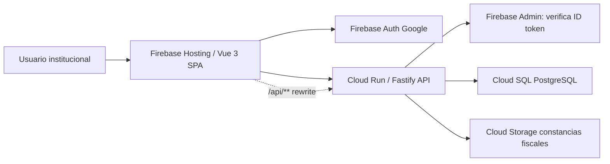

# SDD Retrospectivo: Nómina Docente Vue 3 + Firebase Auth + Cloud Run + PostgreSQL

## 1. Contexto general

Este documento describe el estado actual del sistema Nómina Docente después del cierre técnico y operativo del Hotfix H01 de precisión monetaria.

El sistema moderno reemplaza gradualmente la operación legacy basada en Google Apps Script y hojas de cálculo. La implementación actual usa una Web App Vue 3 publicada en Firebase Hosting, autenticación con Firebase Auth, API Fastify desplegada en Cloud Run y base de datos PostgreSQL en Cloud SQL.

Estado de certeza:

- Confirmado en código: existe frontend Vue 3, backend Fastify, PostgreSQL/Cloud SQL, Firebase Auth, Firebase Hosting, Cloud Run, Cloud Storage para constancias fiscales y archivos legacy `Codigo.gs` e `index.html`.
- Confirmado por operación: H01 fue desplegado y validado con una quincena real; el usuario confirmó que el sistema funciona correctamente.
- Pendiente de confirmar: si la app legacy de Apps Script sigue en uso operativo real o solo queda como respaldo histórico.

## 2. Objetivo actual del sistema

Nómina Docente tiene como objetivo centralizar la operación académica y financiera relacionada con docentes, horarios, incidencias, extras, cálculo de nómina, reportes financieros, expedientes fiscales, calendario operativo, accesos y auditoría.

Objetivos funcionales confirmados en código:

- Controlar acceso por usuario, rol y permisos.
- Gestionar docentes activos e inactivos.
- Gestionar horarios por ciclo académico, coordinación, docente, asignatura, grupo y tabulador.
- Capturar incidencias por quincena: faltas, retardos y extras dentro del horario.
- Capturar horas extra independientes por docente.
- Calcular nómina quincenal con base en calendario operativo, horarios, incidencias, extras y tabuladores.
- Guardar corridas de nómina con detalle histórico.
- Consultar Finanzas/Reportes sobre nóminas guardadas.
- Gestionar expedientes fiscales y constancias.
- Gestionar calendario, ciclos, quincenas, días inhábiles y ventanas de captura.
- Auditar acciones relevantes en bitácora.

Pendiente de confirmar con operación:

- Alcance final esperado para cierre de cuatrimestre moderno más allá de la activación/cierre de ciclos.
- Política formal de retiro o congelamiento del sistema Apps Script.

## 3. Arquitectura actual

Arquitectura confirmada en código y despliegue:



Componentes principales:

- Frontend: SPA Vue 3 con Vue Router, Pinia, TypeScript y Vite.
- Hosting: Firebase Hosting publica `apps/web/dist`.
- Rewrite: Firebase Hosting reenvía `/api/**` al servicio Cloud Run `nomina-api` en `us-central1`.
- Backend: API Fastify en Cloud Run.
- Base de datos: PostgreSQL en Cloud SQL.
- Autenticación: Firebase Auth con Google.
- Autorización: roles y permisos almacenados en PostgreSQL.
- Archivos: constancias fiscales en Cloud Storage.
- Auditoría: tabla `audit_log`.

Despliegue confirmado de H01:

- Commit: `6269320b89188340b17ab86a370ff70b3b5ee98e`
- Tag: `hotfix-h01-money-precision-6269320`
- Cloud Run: `nomina-api-00043-p96`
- Firebase Hosting: versión `ffa4489d79ffc477`
- Asset frontend: `/assets/index-Dqi2usvi.js`

## 4. Tecnologías utilizadas

Tecnologías confirmadas en archivos `package.json`, configuración y código:

| Capa | Tecnología | Uso |
|---|---|---|
| Frontend | Vue 3 | Interfaz SPA modular por vistas |
| Frontend | Vite | Build y dev server |
| Frontend | TypeScript | Tipado de vistas y contrato API |
| Frontend | Vue Router | Rutas reales por módulo |
| Frontend | Pinia | Estado centralizado de sesión/permisos |
| Frontend | Firebase JS SDK | Login con Google |
| Frontend | lucide-vue-next | Iconografía |
| Backend | Node.js | Runtime API |
| Backend | Fastify | Servidor HTTP |
| Backend | TypeScript | Tipado del backend |
| Backend | Zod | Validación de request body/query/params |
| Backend | pg | Conexión PostgreSQL |
| Backend | firebase-admin | Verificación de tokens y Storage |
| Backend | pdfkit | PDFs financieros/comprobantes |
| Backend | decimal.js | Cálculo monetario preciso tras H01 |
| Base de datos | PostgreSQL | Persistencia operativa e histórica |
| Infraestructura | Cloud Run | Ejecución API |
| Infraestructura | Firebase Hosting | Hosting frontend y rewrite `/api/**` |
| Infraestructura | Cloud SQL | PostgreSQL administrado |
| Infraestructura | Cloud Storage | Constancias fiscales |

## 5. Estructura de carpetas

Estructura confirmada:

```text
apps/
  api/
    src/
      auth.ts
      config.ts
      db.ts
      firebase.ts
      lib/decimal.ts
      routes.ts
      routes/
        academic-context.ts
        audit.ts
        calendar.ts
        catalogs.ts
        extras.ts
        incidences.ts
        payroll.ts
        reports.ts
        schedules.ts
        teachers.ts
        users.ts
      server.ts
      types.ts
  web/
    src/
      api.ts
      App.vue
      AppLegacy.vue
      components/layout/AppLayout.vue
      components/modals/
      router/index.ts
      stores/auth.ts
      utils/format.ts
      views/
database/
  001_initial_schema.sql
  ...
  010_payroll_no_rounding_precision.sql
docs/
  auditoria/
  sdd/
tools/
Codigo.gs
index.html
firebase.json
cloudbuild.api.yaml
```

Confirmado:

- `apps/api/src/routes/payroll.ts` y `apps/api/src/routes/reports.ts` son archivos grandes y concentran lógica crítica.
- `apps/web/src/views/FinanceReportsView.vue`, `CalendarView.vue`, `PayrollView.vue`, `ExtrasView.vue`, `FiscalRecordsView.vue` e `IncidencesView.vue` también concentran lógica relevante de UI.

Riesgo relacionado:

- H08 P2: lógica concentrada en archivos grandes.

## 6. Módulos existentes

Módulos confirmados por rutas frontend:

| Módulo | Vista | Ruta |
|---|---|---|
| Login | `LoginView.vue` | `/login` |
| Dashboard | `DashboardView.vue` | `/` |
| Directorio docente | `TeachersView.vue` | `/docentes` |
| Expediente fiscal | `FiscalRecordsView.vue` | `/expediente-fiscal` |
| Capturar horarios | `SchedulesView.vue` | `/horarios` |
| Capturar incidencias | `IncidencesView.vue` | `/incidencias` |
| Capturar extras | `ExtrasView.vue` | `/extras` |
| Nómina | `PayrollView.vue` | `/nomina` |
| Reportes y Finanzas | `FinanceReportsView.vue` | `/finanzas` |
| Calendario operativo | `CalendarView.vue` | `/calendario` |
| Catálogos | `CatalogsView.vue` | `/catalogos` |
| Control de accesos | `AccessView.vue` | `/accesos` |
| Auditoría y bitácora | `AuditView.vue` | `/auditoria` |

Módulos backend confirmados por rutas:

- `users.ts`: control de accesos.
- `teachers.ts`: docentes, exportaciones y constancias fiscales.
- `schedules.ts`: horarios y contexto de captura.
- `incidences.ts`: incidencias por quincena.
- `extras.ts`: horas extra.
- `payroll.ts`: cálculo, preview, guardado y exportes de nómina.
- `reports.ts`: finanzas, reportes, PDFs, CSV y flujo financiero.
- `calendar.ts`: ciclos, quincenas, módulos y días inhábiles.
- `catalogs.ts`: asignaturas y tabuladores.
- `audit.ts`: bitácora y exportación CSV.

## 7. Flujos funcionales principales

### 7.1 Login y sesión

Confirmado en código:

1. El usuario inicia sesión con Google desde Firebase Auth.
2. El frontend obtiene un ID token.
3. Cada request API protegida envía `Authorization: Bearer <token>`.
4. La API verifica el token con Firebase Admin.
5. La API valida correo verificado y dominio permitido.
6. La API busca el correo en `app_users`.
7. Si el usuario está activo, carga rol y permisos desde PostgreSQL.
8. Si `firebase_uid` está vacío, se vincula al primer login; si difiere en logins posteriores, se rechaza.

Pendiente de confirmar:

- Política operativa para usuarios que cambian cuenta Google o requieren re-vinculación de `firebase_uid`.

### 7.2 Directorio docente

Confirmado en código:

- Gestiona docentes, datos fiscales, RFC, correo, banco/detalle, estatus, categoría, coordinación y constancia fiscal.
- Los docentes tienen estatus `ACTIVO` o `INACTIVO`.
- La eliminación física se bloquea si el docente tiene horarios, extras o líneas de nómina; en ese caso se debe inactivar para conservar historial.
- Las constancias fiscales se almacenan en Cloud Storage y se registra el documento actual en `teacher_documents`.

Inferido por diseño de rutas y vistas:

- Directorio funciona como fuente principal para nómina, finanzas y pendientes fiscales.

### 7.3 Horarios

Confirmado en código:

- Los horarios pertenecen a un ciclo académico.
- Se asignan a docente, coordinación, asignatura/grupo y tabulador.
- Manejan horas L, M, X, J, V, S1 y S2.
- La categoría docente define límite operativo mediante `categoryMaxHours`: V = 35, M = 25, N = 15.
- La API restringe escritura a ciclos no cerrados.
- Coordinadores quedan asociados a coordinación por resolución de usuario.

Pendiente de confirmar:

- Política final para editar horarios de ciclos en planeación versus ciclos activos.

### 7.4 Incidencias

Confirmado en código:

- Las incidencias se registran por horario y por `calendar_config_id`.
- Campos: faltas, retardos y extras dentro del horario.
- Faltas y retardos son horas/valores operativos, no dinero.
- Las incidencias se vinculan a ventanas de acceso definidas por el calendario operativo.
- La edición depende de ciclo, ventana de acceso, bloqueo por nómina y coordinación.

Regla confirmada en código de nómina:

- Retardos descuentan `retardos * 0.5` horas.
- Faltas descuentan horas directas.
- Extras de incidencia se suman al pago con el tabulador del horario.

### 7.5 Extras

Confirmado en código:

- Los extras se registran en `extra_hours`.
- Tienen docente, coordinación, ciclo, horas, tabulador, motivo, fecha de actividad, referencia y observaciones.
- El importe se calcula como `hours * tabulator_amount`.
- La fecha de actividad debe pertenecer a una quincena configurada.
- La edición depende de ventana de acceso, bloqueo por nómina y coordinación.

Pendiente de confirmar:

- Política formal de excepciones cuando un extra rebasa carga máxima por categoría.

### 7.6 Nómina

Confirmado en código:

- Puede calcular preview con `/payroll/preview`.
- Puede guardar corrida con `/payroll/runs`.
- El guardado requiere `payroll.finalize` o super admin protegido.
- Se toman horarios, incidencias y extras del ciclo/quincena seleccionados.
- Se guardan snapshots en `payroll_runs`, `payroll_lines`, `payroll_schedule_details` y `payroll_extra_details`.

Confirmado por operación:

- Después de H01, una quincena real cuadró globalmente, por coordinación y en casos con faltas, retardos y extras.

### 7.7 Finanzas

Confirmado en código:

- Finanzas lee nóminas guardadas, no recalcula desde capturas vivas.
- Permite consultar líneas, coordinaciones, pendientes fiscales, histórico, detalles, CSV y PDFs.
- Maneja flujo de estados: `CALCULADA`, `EN_REVISION`, `APROBADA`, `PAGADA`, `CANCELADA`.
- Permite cancelar para corrección si el usuario tiene permisos suficientes.

Pendiente de confirmar:

- Uso futuro de estados `BORRADOR` y `CERRADA`.

### 7.8 Calendario operativo

Confirmado en código:

- Admin con `calendar.manage` gestiona ciclos y quincenas.
- Los ciclos tienen fechas modulares de módulo 1 y módulo 2.
- Las quincenas tienen fecha de inicio/cierre, días inhábiles y ventanas de acceso para incidencias/extras.
- Activar un ciclo cierra otros ciclos activos.

Pendiente de confirmar:

- Si la operación requiere cierre de cuatrimestre con archivo histórico adicional fuera de `academic_cycles`, snapshots de nómina y datos existentes.

## 8. Modelo de datos PostgreSQL

Tablas confirmadas por SQL:

| Tabla | Propósito |
|---|---|
| `roles` | Catálogo de roles |
| `permissions` | Catálogo de permisos |
| `role_permissions` | Relación rol-permiso |
| `app_users` | Usuarios autorizados |
| `coordinations` | Coordinaciones |
| `teachers` | Directorio docente |
| `teacher_documents` | Constancias fiscales y documentos docentes |
| `subjects` | Catálogo de asignaturas |
| `tabulators` | Catálogo de tabuladores de pago |
| `academic_cycles` | Ciclos académicos/cuatrimestres |
| `payroll_calendar_config` | Quincenas y ventanas operativas |
| `calendar_blackout_dates` | Días inhábiles por quincena |
| `schedules` | Horarios docentes |
| `schedule_incidences` | Incidencias por horario/quincena |
| `extra_hours` | Extras capturados |
| `payroll_runs` | Corridas guardadas de nómina |
| `payroll_lines` | Totales por docente/coordinación |
| `payroll_schedule_details` | Detalle histórico de horarios considerados en nómina |
| `payroll_extra_details` | Detalle histórico de extras considerados en nómina |
| `quarter_closures` | Registro previsto de cierres de cuatrimestre |
| `audit_log` | Bitácora del sistema |

Tipos ENUM confirmados:

- `user_status`: `ACTIVO`, `INACTIVO`
- `teacher_status`: `ACTIVO`, `INACTIVO`
- `cycle_status`: `PLANEACION`, `ACTIVO`, `CERRADO`
- `payroll_run_status`: `BORRADOR`, `CALCULADA`, `APROBADA`, `CERRADA`, `CANCELADA`, `EN_REVISION`, `PAGADA`

Confirmado después de H01:

- Las columnas monetarias relevantes usan `numeric`.
- La API lee importes como texto decimal y calcula con `Decimal`.

Pendiente de confirmar:

- No se detectó tabla formal de migraciones aplicadas; existe una serie de SQL incrementales idempotentes.

## 9. Autenticación con Firebase Auth

Confirmado en código:

- El frontend usa Firebase Auth con `GoogleAuthProvider`.
- El parámetro `hd: 'tecplayacar.edu.mx'` está comentado en frontend.
- El backend valida dominio con `ALLOWED_EMAIL_DOMAIN`.
- En producción se desplegó `ALLOWED_EMAIL_DOMAIN=tecplayacar.edu.mx`.
- La API rechaza correos no verificados, dominio no permitido, token inválido, usuarios no registrados o usuarios inactivos.

Riesgo pendiente:

- H07 P2: el parámetro `hd` comentado permite que usuarios externos intenten login antes de ser rechazados por backend. No parece brecha crítica porque backend valida dominio.

## 10. Autorización, roles y permisos

Confirmado en código:

- Los permisos se cargan desde PostgreSQL al resolver sesión.
- El frontend usa Pinia para exponer helpers como `canManageTeachers`, `canManageSchedules`, `canViewPayroll`, `canViewFinanceReports`, `canManageCalendar`, `canViewAudit`, etc.
- El backend protege rutas con `requirePermission`, `requireAnyPermission` o `requirePermissionOrProtectedSuperAdmin`.
- Existe un administrador general protegido: `victor.yama@tecplayacar.edu.mx`.
- El super admin protegido no puede eliminarse, degradarse, renombrarse ni desactivarse.

Roles confirmados:

| Rol | Alcance observado |
|---|---|
| `admin` | Acceso administrativo completo |
| `coordinador` | Captura/consulta operativa, con restricciones por coordinación |
| `direccion` | Consulta ejecutiva global de nómina viva y finanzas sin acciones operativas |
| `rh` | Consulta operativa y gestión de expedientes fiscales |
| `finanzas` | Consulta financiera y expedientes fiscales |
| `contador` | Consulta financiera/contable |
| `contabilidad` | Rol adicional equivalente a consulta contable |

Permisos relevantes confirmados:

- `dashboard.view`
- `teachers.manage`
- `schedules.manage`
- `incidences.manage`
- `extras.manage`
- `payroll.view`
- `payroll.calculate`
- `payroll.finalize`
- `reports.view`
- `statistics.view`
- `finance.view`
- `finance.global_view`
- `fiscal.manage`
- `calendar.manage`
- `closures.manage`
- `access.manage`
- `audit.view`

Riesgos pendientes:

- H02 P1: resolución de coordinación por `display_name`, `legacy_username` o `actor.displayName` es funcional pero frágil ante cambios de nombre.
- H03 P1: el alcance de `finance.view` y `fiscal.manage` sobre edición fiscal requiere confirmación formal de operación.

## 11. API Fastify y rutas principales

Rutas base confirmadas:

- `GET /health`
- `GET /auth/session`
- `GET /dashboard/overview`

Rutas por módulo confirmadas:

| Módulo | Rutas principales |
|---|---|
| Usuarios | `GET/POST/PATCH/DELETE /users` |
| Docentes | `GET/POST/PATCH/DELETE /teachers`, exportes, constancias |
| Horarios | `GET /schedules/context`, `POST /schedules`, `PATCH /schedules/:id`, `DELETE /schedules/:id` |
| Incidencias | `GET /incidences/context`, `PATCH /incidences/:scheduleId`, `PATCH /incidences` |
| Extras | `GET /extras/context`, `POST /extras`, `PATCH /extras/:id`, `DELETE /extras/:id` |
| Nómina | `GET /payroll/context`, `POST /payroll/preview`, `POST /payroll/runs`, `GET /payroll/runs/:id`, exportes |
| Finanzas | contexto, cambio de estado, CSV/PDF, comprobantes |
| Calendario | `GET /calendar/context`, ciclos, activación, módulos, quincenas |
| Catálogos | `GET /catalogs/context`, asignaturas, tabuladores |
| Auditoría | `GET /audit/logs`, `GET /audit/export` |

Confirmado:

- `server.ts` registra rutas tanto sin prefijo como con prefijo `/api`.
- Firebase Hosting usa rewrite `/api/**` hacia Cloud Run.

## 12. Validaciones con Zod

Confirmado en código:

- Las rutas usan Zod para validar `params`, `query` y `body`.
- Se validan UUIDs, fechas, estatus, textos, números operativos y campos monetarios.
- Después de H01, campos monetarios críticos se validan como decimal string/Decimal y no con `z.coerce.number()`.
- Las horas se validan como decimal operativo y se separan conceptualmente del dinero.

Pendiente de confirmar:

- No se detectó suite automatizada de pruebas de validaciones por ruta.

## 13. Cálculo de nómina

Confirmado en código:

El cálculo de nómina se realiza principalmente en `apps/api/src/routes/payroll.ts`.

Entradas principales:

- Ciclo activo o ciclo seleccionado.
- Quincena de `payroll_calendar_config`.
- Días inhábiles de `calendar_blackout_dates`.
- Fechas modulares del ciclo.
- Horarios de `schedules`.
- Incidencias de `schedule_incidences`.
- Extras de `extra_hours`.
- Tabulador capturado en horario o extra.

Reglas confirmadas en código:

- Horas L-V se multiplican por las veces que aparece cada día dentro de la quincena.
- Módulo 1 y módulo 2 se calculan por sábados que caen dentro del periodo modular.
- Faltas descuentan horas directas con el tabulador del horario.
- Retardos descuentan `0.5` horas por retardo con el tabulador del horario.
- Extras de incidencia se pagan con el tabulador del horario.
- Extras del módulo Extras se pagan con su tabulador capturado.
- Total por línea: `baseNetAmount + totalExtraAmount`.
- Total extra: `scheduleExtraAmount + loggedExtraAmount`.
- La corrida guardada genera snapshots históricos.

Fórmula resumida confirmada:

```text
baseNetAmount = grossBaseAmount - absenceDiscountAmount - delayDiscountAmount
totalExtraAmount = scheduleExtraAmount + loggedExtraAmount
totalAmount = baseNetAmount + totalExtraAmount
```

Pendiente de confirmar:

- Si existen reglas especiales por docente, carrera o periodo no representadas actualmente en código.

## 14. Precisión monetaria después de H01

H01 está cerrado.

Confirmado en código:

- `apps/api/src/lib/decimal.ts` centraliza:
  - `toMoneyDecimal`
  - `moneyToDb`
  - `moneyToApi`
  - `addMoney`
  - `subtractMoney`
  - `multiplyMoney`
  - helpers separados para horas.
- La API usa `decimal.js`.
- Los importes se normalizan a dos decimales con `Decimal.ROUND_HALF_UP`.
- PostgreSQL conserva `numeric`.
- La API expone importes monetarios como string decimal.
- El frontend actualizó el contrato con `MoneyString`.
- El frontend formatea dinero pero no calcula la nómina oficial.

Confirmado por despliegue:

- Cloud Run sirve `nomina-api-00043-p96`.
- Firebase Hosting sirve asset `/assets/index-Dqi2usvi.js`.
- `/api/health` respondió `200 OK`.

Confirmado por operación:

- La quincena real validada cuadró después del despliegue.

## 15. Incidencias y extras

Incidencias confirmadas:

- Se guardan por horario y quincena.
- Campos: `absences`, `delays`, `extra_hours_in_schedule`.
- Impactan nómina al calcular descuentos y extras de horario.
- Están sujetas a ventana de captura y bloqueo por nómina.

Extras confirmados:

- Se guardan en `extra_hours`.
- Campos principales: docente, coordinación, ciclo, horas, tabulador, motivo, fecha de actividad, referencia y observaciones.
- Se filtran por quincena usando fecha de actividad.
- Impactan nómina como `loggedExtraAmount`.

Riesgos/pendientes:

- Confirmar formalmente política de sobrecarga permitida cuando extras rebasan límite por categoría.
- Confirmar que toda corrección posterior a nómina guardada debe hacerse mediante cancelación de corrida y nueva captura/cálculo.

## 16. Calendario operativo

Confirmado en código:

- El calendario se modela con `academic_cycles`, `payroll_calendar_config` y `calendar_blackout_dates`.
- Las fechas modulares pertenecen al ciclo.
- Las quincenas pertenecen al ciclo.
- Las ventanas de acceso para incidencias y extras se configuran por quincena.
- Días inhábiles se descuentan del conteo operativo de días.
- Al activar un ciclo, el ciclo activo anterior se cierra.

Inferido:

- El calendario es la fuente operativa para Nómina, Incidencias y Extras.

Pendiente de confirmar:

- Si cierre de cuatrimestre requiere un módulo adicional explícito o si el cierre vía `academic_cycles.status='CERRADO'` cubre la operación actual.

## 17. Finanzas y reportes

Confirmado en código:

- Finanzas consume nóminas guardadas desde `payroll_runs`, `payroll_lines`, `payroll_schedule_details` y `payroll_extra_details`.
- No debe recalcular desde capturas vivas.
- Genera CSV y PDF.
- Incluye reportes por pagos, pendientes fiscales, coordinaciones, históricos y comprobantes.
- Controla flujo financiero de estados.
- Dirección/Subdirección puede ver globalmente sin acciones operativas mediante `finance.global_view`.

Estados confirmados:

- `CALCULADA`
- `EN_REVISION`
- `APROBADA`
- `PAGADA`
- `CANCELADA`

Pendiente de confirmar:

- Uso futuro de `BORRADOR` y `CERRADA`.

## 18. Auditoría / bitácora

Confirmado en código:

- Existe tabla `audit_log`.
- El módulo `/auditoria` consulta y exporta eventos.
- La API registra acciones de usuarios, docentes, ciclos, incidencias y otros cambios operativos relevantes.
- El acceso está protegido por `audit.view`.

Pendiente de confirmar:

- Política de retención de auditoría.
- Si se requiere bitácora inmutable o exportación periódica para cumplimiento.

## 19. Archivos y constancias fiscales

Confirmado en código:

- Las constancias fiscales se cargan vía API.
- Los archivos se almacenan en Cloud Storage usando `CONSTANCIAS_BUCKET`.
- Se registra metadata en `teacher_documents`.
- Al subir una nueva constancia, las anteriores se marcan como no actuales.
- El endpoint de documento actual descarga el archivo desde Storage.

Permisos confirmados:

- Carga de constancia: `teachers.manage`, `finance.view` o `fiscal.manage`.
- Consulta de constancia: `teachers.manage`, `finance.view`, `reports.view` o `fiscal.manage`.

Riesgo pendiente:

- H03 P1: confirmar si Finanzas debe poder editar/cargar expediente fiscal o si esa acción debe quedar solo para RH/Admin.

## 20. Sistema legado Apps Script

Confirmado en repositorio:

- Existen archivos `Codigo.gs` e `index.html` en la raíz.
- El README indica que la app legacy se conserva como referencia funcional durante la migración.

Inferido:

- El sistema moderno fue construido como reemplazo incremental del sistema Apps Script/Sheets.

Pendiente de confirmar:

- Si Apps Script sigue activo para operación diaria.
- Si las hojas de cálculo siguen siendo fuente de verdad en algún proceso.
- Estrategia formal de congelamiento, retiro o solo consulta histórica.

Riesgos relacionados:

- H06 P1: coexistencia con Apps Script legado.
- H14 P3: legado extenso requiere inventario antes de eliminación.

## 21. Riesgos técnicos pendientes

H01 queda cerrado. Riesgos pendientes:

| ID | Prioridad | Riesgo | Estado |
|---|---|---|---|
| H02 | P1 | Resolución de coordinación por `display_name` / `legacy_username` | Pendiente |
| H03 | P1 | Alcance de `finance.view` y `fiscal.manage` sobre edición fiscal | Pendiente |
| H04 | P1 | Falta de pruebas automatizadas | Pendiente |
| H05 | P1 | Migraciones SQL sin control formal de ejecución | Pendiente |
| H06 | P1 | Coexistencia con Apps Script legado | Pendiente |
| H07 | P2 | Provider Google con `hd` comentado | Pendiente |
| H08 | P2 | Lógica concentrada en archivos grandes | Pendiente |
| H09 | P2 | Estados `BORRADOR` y `CERRADA` no usados claramente | Pendiente |
| H10 | P2 | Cierre de cuatrimestre moderno pendiente de confirmar | Pendiente |
| H11 | P2 | Exportables CSV con posible diferencia de codificación | Pendiente |
| H12 | P2 | Dependencia de nombres para catálogos/tabuladores históricos | Pendiente |
| H13 | P3 | Variables reales de producción no versionadas | Pendiente |
| H14 | P3 | Legado Apps Script con lógica extensa | Pendiente |

## 22. Deuda técnica

Confirmado o inferido por estructura:

- Archivos backend grandes: `payroll.ts`, `reports.ts`, `schedules.ts`, `teachers.ts`, `extras.ts`, `calendar.ts`.
- Vistas frontend grandes: `FinanceReportsView.vue`, `CalendarView.vue`, `PayrollView.vue`, `ExtrasView.vue`, `FiscalRecordsView.vue`, `IncidencesView.vue`.
- No se detectó suite de pruebas automatizadas de negocio.
- No se detectó herramienta formal de migraciones.
- La resolución de coordinación depende de texto/nombre.
- El frontend aún conserva `AppLegacy.vue`.
- El proveedor Google tiene `hd` comentado.
- El sistema legacy permanece en el repositorio.

## 23. Pendientes por confirmar con operación

- Si Apps Script sigue siendo usado por alguna coordinación o área financiera.
- Si el cierre de cuatrimestre moderno cubre al 100% la operación esperada.
- Uso real de estados `BORRADOR` y `CERRADA`.
- Si Finanzas debe editar expedientes fiscales o solo consultar.
- Si RH debe tener captura operativa amplia o solo expediente fiscal.
- Política ante sobrecargas por categoría cuando se capturan extras.
- Política de retención de bitácora.
- Política de inactivación/renombrado de catálogos usados históricamente.
- Proceso formal de corrección de nómina posterior a guardado.
- Requerimientos formales de CSV/PDF para Excel, acentos y auditoría.

## 24. Recomendaciones por prioridad

### P0

- H01 precisión monetaria: cerrado. Mantener regresión obligatoria en cada cambio de Nómina/Finanzas.

### P1

- Documentar y corregir la resolución de coordinación para usar relación explícita usuario-coordinación.
- Confirmar matriz rol-permiso-acción, especialmente `finance.view` y `fiscal.manage`.
- Crear suite mínima de pruebas automatizadas para cálculo de nómina.
- Formalizar migraciones SQL con tabla de control y procedimiento de rollback.
- Definir plan operativo para Apps Script: congelar, retirar o mantener como histórico.

### P2

- Revisar `hd` en Google Provider para mejorar experiencia de login.
- Refactorizar gradualmente archivos grandes por servicios internos, sin cambiar reglas.
- Aclarar estados de nómina no usados.
- Confirmar cierre de cuatrimestre moderno.
- Estandarizar codificación de CSV y pruebas en Excel.
- Definir política de catálogos históricos.

### P3

- Documentar variables productivas no secretas y checklist de despliegue.
- Inventariar lógica legacy antes de eliminar o archivar definitivamente.
- Crear `AGENTS.md`, Skills y workflow de mantenimiento cuando el sistema quede estabilizado.
